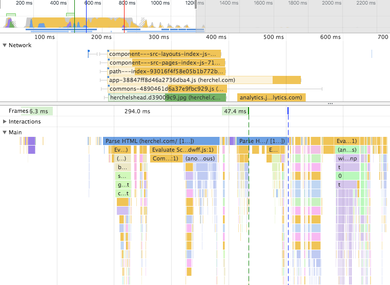

Gatsby is a ReactJS based static site generator. This means that the *build process* will automatically generate all files that are sent to the end-user's computer. You don't need to do server-side processing. 

There are many static site generators, but what makes Gatsby unique is is *raw, unbridled speed*. Gatsby follows the [PRPL pattern](https://developers.google.com/web/fundamentals/performance/prpl-pattern/), which is a technique being pushed by Google for making fast PWAs (Progressive Web Apps). 

<figure>
    
    <figcaption>Gatsby's initial page-load is fast!</figcaption>
</figure>

## What is PRPL?

PRPL stands for 

* **Push** critical resources for the initial URL route. Basically this uses [HTTP/2 Server push](https://www.smashingmagazine.com/2017/04/guide-http2-server-push/), which allows you to send site assets to the user before they’ve even asked for them.
* **Render** initial route. This is the basic rendering of the web page.
* **Pre-cache** remaining routes. This includes analyzing any current hyperlinks, and then downloading the code for each before they're needed. Gatsby uses a service worker to pre-fetch and cache.
* **Lazy-load** and create remaining routes on demand. As the end-user scrolls down the page, each hyperlink that comes into the viewport also gets pre-downloaded.

Because each page is pre-downloaded, when the end user clicks a link, the next page is rendered instantly. There's no performance penalty for pre-downloading the pages because this happens in the background after your page is rendered.

## This sounds complicated.

It is complicated. Normally, you'd have to create a custom webpack config with code splitting, tree-shaking and goat-sacrificing to do this properly. 

Gatsby, on the other hand, makes it easy. It just handles it - in fact, it's pretty hard to make a slow website in Gatsby. Gatsby will automatically follow this pattern. If you open up the network panel in Chrome Developer Tools, you can watch the network requests filter in as you scroll down the page. Cool!

<figure>
    <video width="100%" autoplay controls loop muted>
      <source src="./gatsby-lazy-loading.mp4" type="video/mp4">
    </video>
    <figcaption>As I scroll, Gatsby prefetches resources</figcaption>
</figure>

## Gatsby has a number of out-of-the-box speed optimizations:

### Inline critical CSS

Styles (CSS) are normally stored in a separate monolithic "stylesheet" that gets downloaded after the initial webpage is downloaded. The benefit of this is that the stylesheet gets stored in the browser's cache, and doesn't have to re-download on subsequent page-loads. 

The downside of this approach is that the browser has to wait until the large monolithic stylesheet is downloaded and parsed before it can start rendering the webpage. This adds vital milliseconds to the page-load time.

Gatsby's approach is to identify the CSS that is actually being used on the page, and only adding this CSS to the page. It adds this inline to the webpage, so there's no additional download. It does not have a penalty of having to re-download the stylesheet on page reload, because there are no page reloads!

### No page reloads

Gatsby makes use of React's virtual DOM diffing, aka [Reconciliation](https://reactjs.org/docs/reconciliation.html). 

> When you use React, at a single point in time you can think of the render() function as creating a tree of React elements. On the next state or props update, that render() function will return a different tree of React elements. React then needs to figure out how to efficiently update the UI to match the most recent tree.

So, when you navigate to a link, Gatsby will automatically 1) remove the old HTML that isn't needed 2) Insert the new HTML (that's been cached!), and 3) Jump you to the top of the page. 

### Static rendering of pages

This is pretty obvious because Gatsby is a static site generator. But it still merits mention that Gatsby does not rely on server processing (other than serving static files).

### HTTP/2 push of critical resources

Gatsby will push critical resources via HTTP/2 if necessary. This saves vital milliseconds from the browser parsing the HTML and then making requests to the server for additional resources. Note that although the documentation states that Gatsby uses this, I don't see this in Developer Tools.

### Per-route code/data splitting

Gatsby will only send the JavaScript needed to each page. This saves both bandwidth and CPU time. 

### Prefetch resources

The "P" and the "L" of the PRPL pattern specify that you pre-download content from linked pages, so that the next page load is instantaneous.

## How does development work, if you're not using webpack? 

When developing, you'll run the `gatsby develop` command. This will open up a lightweight http server on your localhost. This also enables hot-reloading, where changes to code (JavaScript, CSS, etc) are visible instantaneously. 

When you're ready to deploy, you'll run `gatsby build`. This will run a webpack build process that does code-splitting, tree-shaking, and wood-knocking to enable your website to be as fast as possible. 

## But it doesn't work without JavaScript, right?

It works without JavaScript! Seriously, disable JS and try it out. It obviously will not do many of the optimizations like pre-fetching routes, but it works. 

## So what else? 

That's not enough? There's lots more to Gatsby, including the developer experience, ease of setup, and plugins. But that's a topic for another blog post.