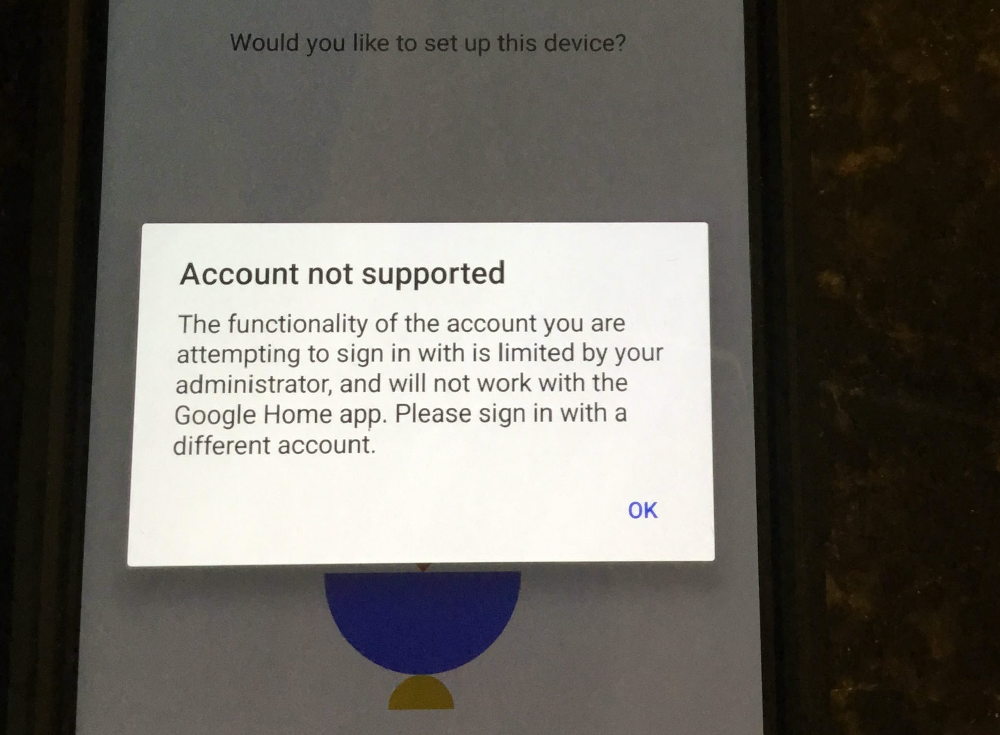
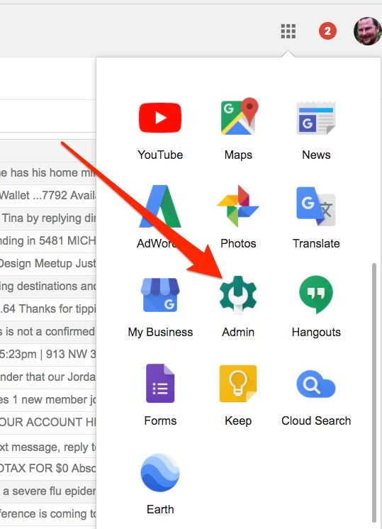
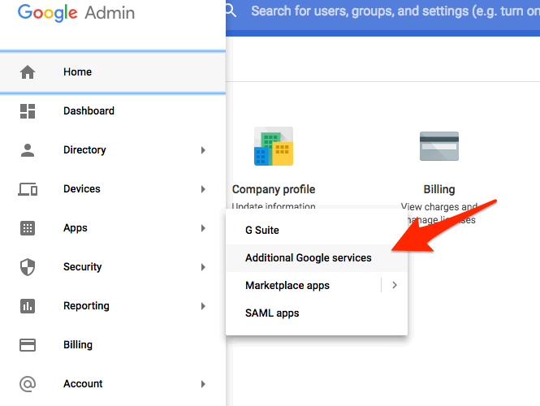
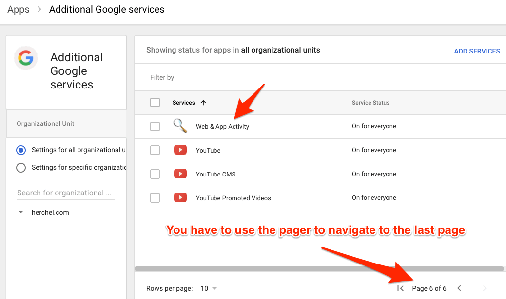
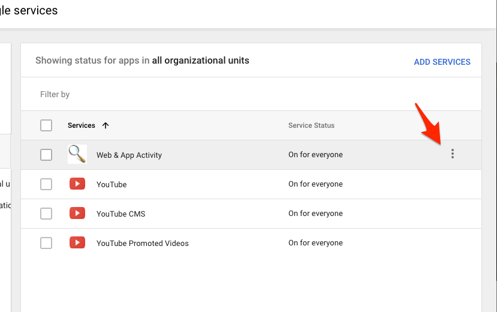
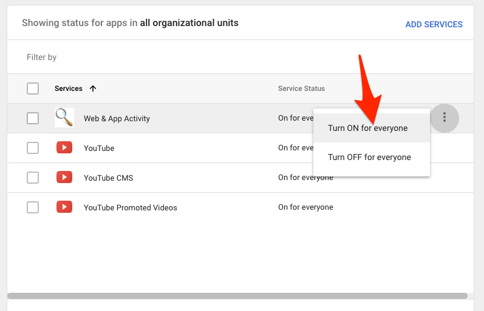

*I'm blogging about this with the hope that someone will find this helpful*.

Google sent me a free Google Home Mini because I purchased a new Pixel 2. While setting it up, I received this error message:

> **Account not supported**
>
> The functionality of the account you are attempting to sign in with is limited by your administrator, and will not work with the Google Home app. Please sign in with a different account.

So, I called Google technical support, and they told me that Google Home Mini does *not* support custom domains on G-suite! What??? This absolutely makes no sense, but they confirmed it. 

Luckily, I tweeted it and received a response that it is supported in some sense. 

<blockquote class="twitter-tweet" data-lang="en">
That&#39;s really weird as mine is on my personal domain. Maybe it&#39;s that mine is a legacy GApps account (I still get 100 users free on it)
&mdash; Chris Wiegman (@ChrisWiegman) <a href="https://twitter.com/ChrisWiegman/status/957281303862407168?ref_src=twsrc%5Etfw">January 27, 2018</a></blockquote>

Doing some additional "Googling" I found [this knowledge base article](https://support.google.com/googlehome/answer/7571892?co=GENIE.Platform%3DAndroid&hl=en-GB), which led me to the solution below:

1. Log into your Google Apps Admin. Note you'll have to hit the "More" button at the bottom of the menu to see this option.

2. From the Google Admin, click the top left menu button, and go to Apps, and then Additional Google Services.

3. Navigate through the pager at the bottom until you find *Web and App Activity*

4. Hover over the row and click the three little menu dots to bring up a contextual menu.

5. Select "Turn ON for everyone"

The change was immediate for me. Hopefully someone can find this useful!