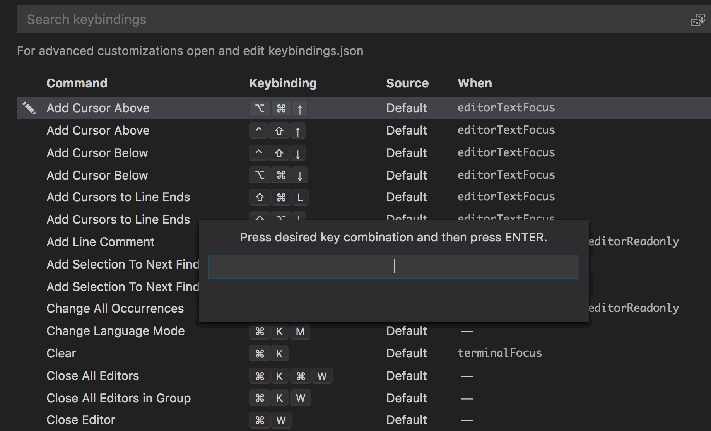

On every new project I try to change one or two tools and/or techniques. 

This is a good balance, because if I change too many things, I get bogged down in the details and complexity of new tools &mdash; but if I change nothing, I never get the chance to learn these new tools, and increase my productivity.

For my current project, I'm switching my text-editor from Sublime Text to [Visual Studio Code](https://code.visualstudio.com/).


## Why the switch?

I've been using [Sublime](https://www.sublimetext.com/) for over 5 years (wow &mdash; time goes fast). I've been hearing from some coworkers and friends that Visual Studio Code has really great JavaScript syntax highlighting and is just *nice*.

<blockquote class="twitter-tweet" data-lang="en"><p lang="en" dir="ltr">What text editor are you using for programming these days?</p>&mdash; Smashing Magazine (@smashingmag) <a href="https://twitter.com/smashingmag/status/951924123357376512?ref_src=twsrc%5Etfw">January 12, 2018</a></blockquote>

I saw the tweet above as I was writing this article, which further solidifies the experiment.

## My background and perspective

I've been developing for the web since 2001, and I started out using Macromedia Dreamweaver and stuck with that through the end of the decade (using the code-only view for the majority of this time).

<figure>
    
    <figcaption>Yes I do still have Dreamweaver installed &mdash; I use it to edit email markup :)</figcaption>
</figure>

In 2012, I switched to Sublime Text 2, which was amazing. It was fast, lightweight, and clean. I installed various plugins including Emmet, ESLint, Sass, and more. I especially liked the multiple cursors functionality. 

<figure>
    
    <figcaption>Screenshot of Sublime Text.</figcaption>
</figure>

I also started using PHPStorm, not just for PHP, but for jQuery. I liked the built in intellisense (autocomplete, quick info, list parameters, etc) that was offered in PHPStorm, but not in Sublime.

<figure>
    
    <figcaption>Screenshot of PHPStorm showing some fancy jQuery that I authored.</figcaption>
</figure>

### What I didn't like about Sublime

Sublime is fast, but it's bare-bones. In order to get to a nice configuration, you need to install and configure many plugins such as [Package Control](https://packagecontrol.io/packages/Package%20Control), [Emmet](https://packagecontrol.io/packages/Emmet), [Sidebar Enhancements](https://packagecontrol.io/packages/SideBarEnhancements), [Sublime Linter](https://packagecontrol.io/packages/SublimeLinter), [Bracket Highlighter](https://packagecontrol.io/packages/BracketHighlighter), etc.

Sublime requires a lot of configuration, it has questionable syntax highlighting, and linting integration not super tight (even with Sublime Linter).

### What I didn't like about PHPStorm

PHPStorm seemed slow and a bit confusing. It's slow to open &mdash; and although it's very feature packed, it's frequently hard to find what you're looking to do. To be fair, the more I've been using it, the more I know my way around the UI.

## About Visual Studio Code

VSCode is *weird*. It's created by Microsoft, which gives it away for free. In addition to Windows, they also support OSX and Linux. Weird. 

It's built on top of [Electron](https://electronjs.org/), which allows for the development of desktop apps using Chromium and Node.

VSCode occupies the sweet spot between IDE and text editor. It's fairly quick to launch &mdash; although not as quick as Sublime Text. But, that's not a huge deal. It's quick enough, and I don't frequently relaunch it. While the editor is open, the runtime seems just as fast 😎.


VSCode comes with a number of features enabled out of the box. Let's take a look. 

## Feature: Better usability than other editors

VSCode takes into account the *little things* that happen when editing. 

One of my favorite examples is that when you start dragging to collapse the sidebar, it will completely disappear when it gets under a minimum width &mdash; because this is what you're intending to do! 

When you want to expand the sidebar back, you can either drag it, *or* you can click on the *files* icon within the left menu bar. This makes it dead-easy for newcomers to figure out the operation.

VSCode also has much of the functionality of Sublime's popular plugins already integrated. This makes it quicker to get up and running, and requires no configuration. VSCode includes functionality similar to [Package Control](https://packagecontrol.io/packages/Package%20Control), [Emmet](https://packagecontrol.io/packages/Emmet), [Sidebar Enhancements](https://packagecontrol.io/packages/SideBarEnhancements), [Bracket Highlighter](https://packagecontrol.io/packages/BracketHighlighter), and more. This makes *a lot* of sense, because the vast majority of users are going to make use of these at a given point.

More little usability wins worth mentioning:

* When deleting from my directory tree, VSCode will send the file to my trash as opposed to just deleting it.
* You can drag and drop files to move them around your directory tree.
* Easy to use git tools (more on this later).
* Easy to use find and replace functionality.

## Feature: Intellisense / Autocomplete just "works"

Intellisense includes autocomplete, quick info, list parameters, and more. And, it's enabled out of the box in VSCode. If you're using JavaScript, it seems to work great &mdash; on par with PHPStorm and better than Sublime. I have yet to use VSCode with PHP.

<figure border>
    <video width="100%" autoplay controls loop muted>
      <source src="./intellisense.mp4" type="video/mp4">
    </video>
    <figcaption>Automatic completion in VSCode</figcaption>
</figure>

## Feature: VSCode's plugin management is top notch

VSCode's plugin handling is great. It's easier than Sublime's plugin handling, which is all text based.

1. The plugin management interface is easy to find. The plugin dashboard has its own icon to the left of the directory tree.
2. It will recommend plugins to you based on the types of files that you open. If I open lots of markdown files, it will recommend a popular markdown plugin. If I open lots of JavaScript files, it will show me plugins for that.
3. It allows you to install plugins through the GUI. Normally, I like to use keyboard shortcuts for everything. But, installing plugins is not a normal day-to-day activity. Browsing, choosing, installing, and configuring plugins is easier through a graphical interface.
4. It shows your currently installed plugins, and allows you to disable/uninstall them easily. This makes it easy to test-drive and compare plugins.
5. You can easily search for new plugins using the GUI, or just show the most popular plugins for you to explore.

<figure>
    
    <figcaption>Annotated screeshot of VSCode's plugin interface.</figcaption>
</figure>

### Tip: Plugins that I currently have installed**

* [Beautify](https://github.com/HookyQR/VSCodeBeautify) reformats and reindents your JavaScript, CSS, HTML and more.
* [Drupal Syntax Highlighting](https://github.com/mastazi/VS-code-drupal) does exactly what you think it does :)
* [ESLint](https://github.com/Microsoft/vscode-eslint) provides integration with the popular ESLint JavaScript linting engine. This highlights syntax errors and code formatting issues in your JavaScript.
* [Markdown All in One](https://github.com/neilsustc/vscode-markdown) provides additional functionality for markdown including `CMD` + `B` to bold your text, and `CMD` + `I` to italicize.
* [Spell Right](https://github.com/bartosz-antosik/vscode-spellright) is a spellchecker for VSCode.
* [Sublime Text Keymap](https://github.com/Microsoft/vscode-sublime-keybindings) adds additional keymaps similar to Sublime Text for VSCode. 
* [VSCode Icons](https://github.com/vscode-icons/vscode-icons) gives you a different icon for each type of file within your file explorer. This makes it much easier to find the file you're looking for.
* [VSCode-styled-components](https://github.com/styled-components/vscode-styled-components) allows for CSS highlighting, indentation, and autocomplete when you're using CSS in JS solutions like [Emotion](https://github.com/emotion-js/emotion).

## Feature: Git Integration

In the past, I've been a command-line git user. This includes managing branches, commits, merges, and even conflicts.

That being said, VSCode's git integration is *nice*. 
<figure>
    
    <figcaption>VSCode diff feature makes changes easy to understand.</figcaption>
</figure>

Out of the box, VSCode also highlights changes within the code view. 

<figure>
    
    <figcaption>VSCode diff feature makes changes easy to understand.</figcaption>
</figure>

VSCode has a really slick git merge conflict resolution process. You can trigger the merge by opening the command palette (`CMD` + `Shift` + `P`), and then type in "git merge". You'll see a list of branches that you can merge into. If there is a conflict, VSCode will present this UI:

<figure>
    
    <figcaption>VSCode makes merge conflicts easy to overcome.</figcaption>
</figure>

Check out the "Accept Current Change", "Accept Incoming Change", "Accept Both Changes", and "Compare Changes" links above the blocks. Clicking one of those will do what you expect it to. Note that you still have the save the file after accepting changes.

## Tip: Common Keyboard shortcuts

Avoiding using your mouse or trackpad is vital to coding quickly. To that end, here are some keyboard shortcuts that I use often.

Note that I have the [Sublime Text Keymap](https://github.com/Microsoft/vscode-sublime-keybindings) extension installed.

* `CMD` + `P` Brings up a prompt where you can type in the name of a file, hit enter, and have the file opened.
* `CMD` + `Shift` + `P` Brings up Command Palette. I frequently use "Change Language Mode".
* `Opt` + `↑ or ↓` Move selected text block. 
* `CTRL` + `CMD` + `G` Select all occurrences of highlighted string
* `CMD` + `D` Select next occurrence of highlighted string
* `CTRL` + `~` Open up the integrated console. I don't use this daily, but it can be useful if I do not have my multiple monitors.
* `Opt` + click a function name to go to function definition. This is called *Hyperclick*.
* `CMD` + `Shift` + **Drag Mouse** - Drags a box to select text. Will not select text outside of box.
* `code .` - From a command line, you can open up VSCode to the current directory ([setup](https://code.visualstudio.com/docs/setup/mac)).

VS Code allows you to easily edit your personal keyboard shortcuts pretty easily under the **Preferences** menu.



## Feature: Visual Studio Code does debugging!

Like an IDE, VSCode can debug your JavaScript (both in-browser, and Node). To get this working for Chrome, add the [Debugger for Chrome](https://marketplace.visualstudio.com/items?itemName=msjsdiag.debugger-for-chrome) extension. You'll need to hit the gear icon to the top of the debugger's left panel to edit the `launch.json` file to something similar to this:

> The extension operates in two modes - it can launch an instance of Chrome navigated to your app, or it can attach to a running instance of Chrome

The following `launch.json` config will launch a new version of Chrome. If you want to use you want to use the attach method, you need to append `--remote-debugging-port=9222` when launching Chrome. The full documentation for Chrome debugger is [available on GitHub](https://github.com/Microsoft/vscode-chrome-debug).

```json
  "version": "0.2.0",
  "configurations": [
    {
      "type": "chrome",
      "request": "launch",
      "name": "Launch Chrome",
      "url": "http://localhost:8000",
      "webRoot": "${workspaceFolder}"
    }
  ]
}
```

To launch Chrome with the debugger enabled, click the play button ▶️ to the top of the debugger's left panel. Now you can set breakpoints, watch expressions, view the call stack and more. 

Note that VSCode can also debug Python, C++, C#, and can be integrated with PHP's Xdebug.

## Conclusion

I *really* like VSCode. To me, it boils down to the following:

* It keeps the same great features as Sublime (multiple cursors, etc)
* Better syntax highlighting
* Git integration &mdash; specifically merge conflict resolution
* [Excellent documentation](https://code.visualstudio.com/docs)

That being said, I'm still very new to it. It's going to take me months to become fully fluent in its features. But, I'm excited to get started!