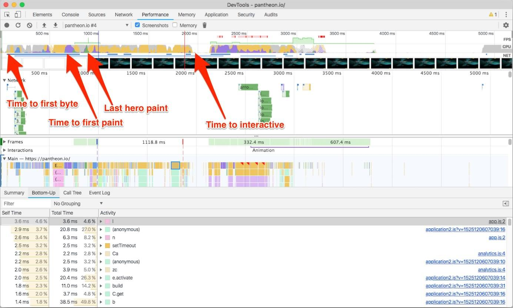
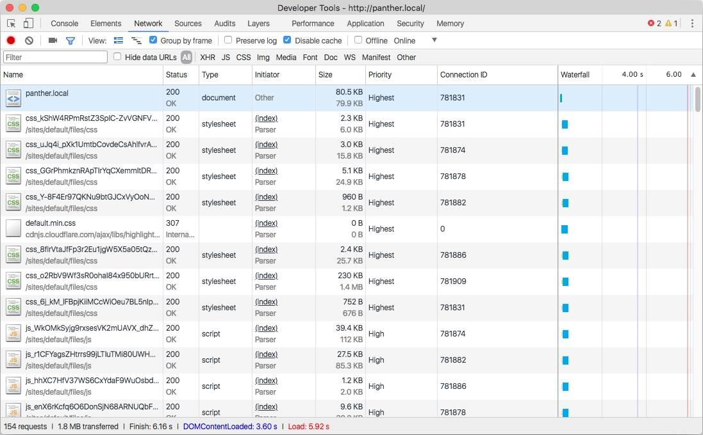
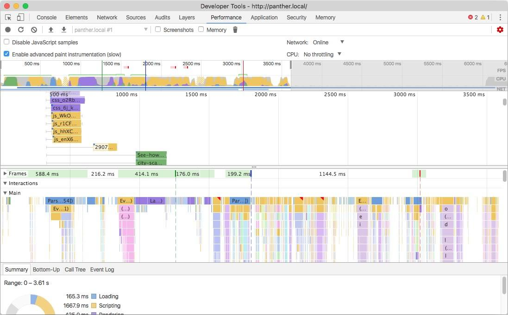
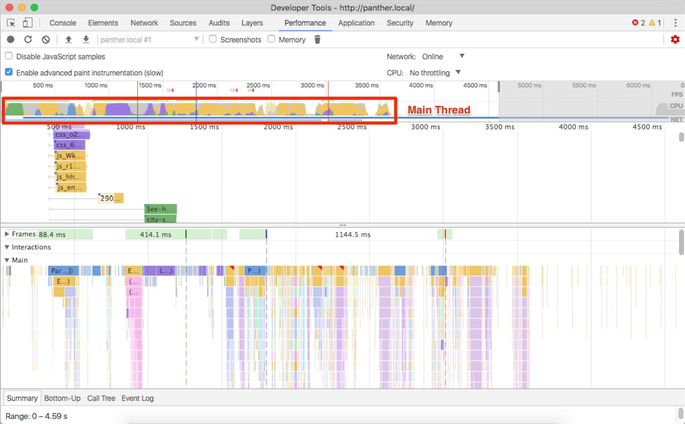
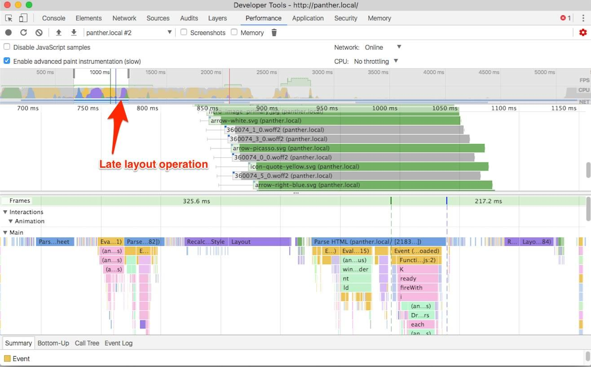
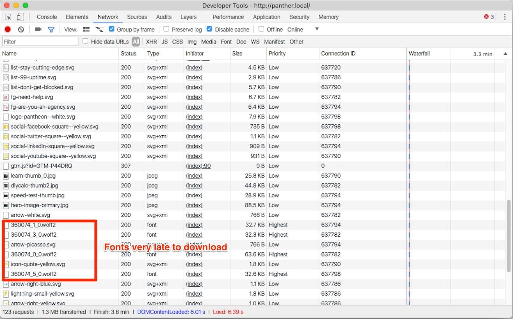
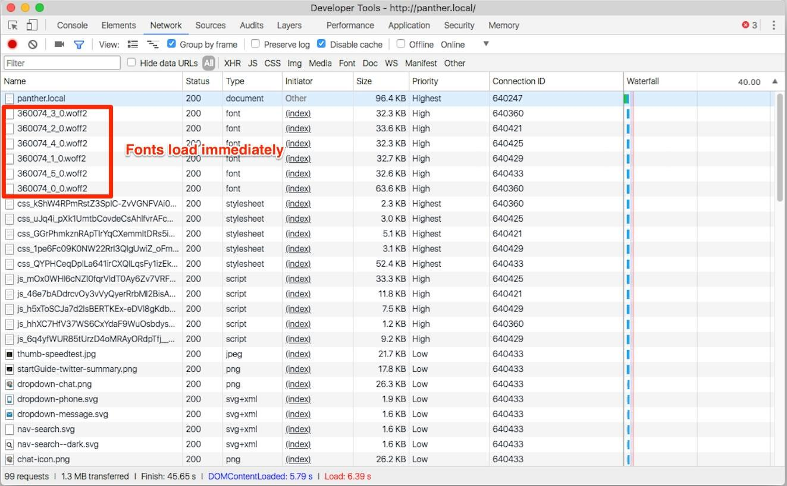
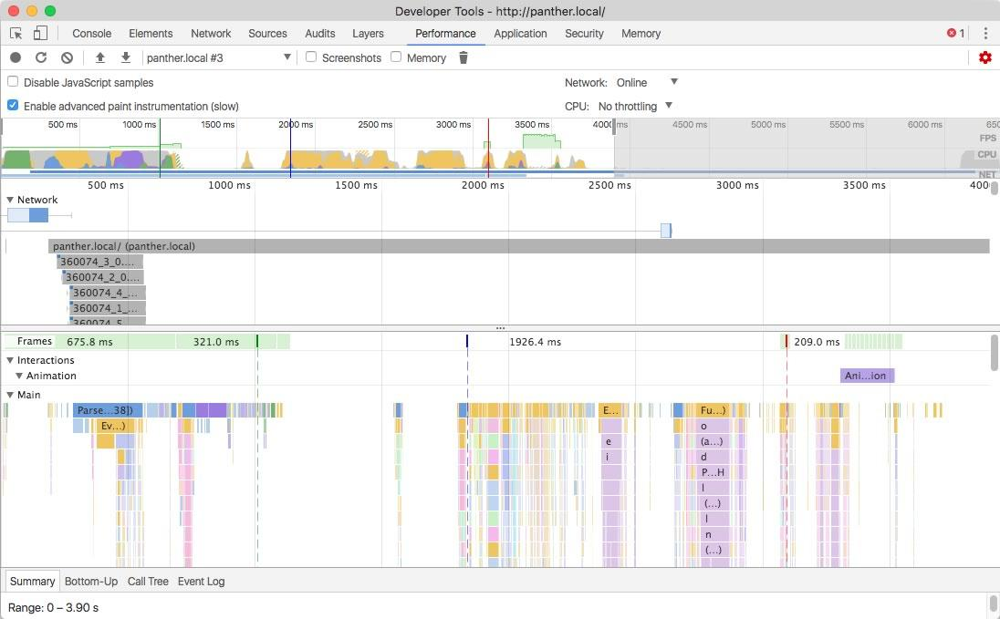
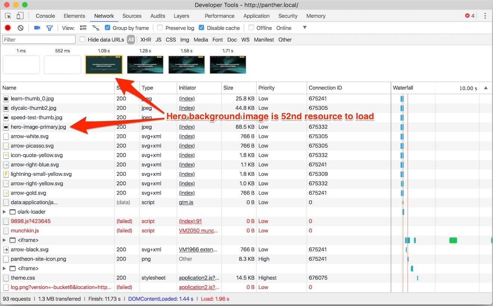
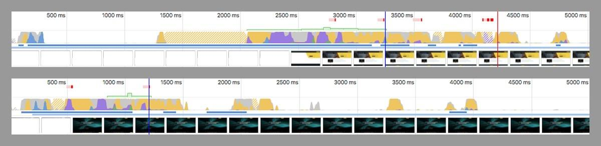

_Note this article was originally published on [Lullabot.com](https://www.lullabot.com/articles/making-legacy-sites-more-performant-using-modern-frontend-techniques)._

Earlier this year Lullabot was engaged to do a redesign of <a href="https://pantheon.io">Pantheon’s homepage</a> and several landing pages. If you’re not familiar with Pantheon, they’re one of the leading hosting companies in the Drupal and WordPress space. The timeline for this project was very ambitious—a rollout needed to happen before Drupalcon Nashville. Being longtime partners in the Drupal community, we were excited to take this on.

The front-end development team joined while our design team was still hard at work. Our tasks were to 1) get familiar with the current Drupal 7 codebase, and 2) make performance improvements where possible. All of this came with the caveat that when the designs landed, we were expected to move on them immediately.

Jumping into Pantheon’s codebase was interesting. It’s a situation that we’ve seen hundreds of times: the codebase starts off modularly, but as time progresses and multiple developers work on it, the codebase grows larger, slower, and more unwieldy. This problem isn’t specific to Drupal – it’s a common pandemic across many technologies.

## Defining website speed

Website speed is a combination of back-end speed and browser rendering speed, which is determined by the front-end code. Pantheon’s back-end speed is pretty impressive. In addition to being built atop Pantheon’s infrastructure, <a href="https://www.lullabot.com/articles/pantheon-adds-free-https-for-all-sites">they have integrated Fastly CDN with HTTP/2</a>.

<blockquote>80-90% of the end-user response time is spent on the front-end.
Start there. – <a href="https://www.stevesouders.com/blog/2012/02/10/the-performance-golden-rule/">Steve Souders</a></blockquote>

In a normal situation, the front-end accounts for 80% of the time it takes for the browser to render a website. In our situation, it was more like 90%.

What this means is that there are a lot of optimizations we can make to make the website even faster. Exciting!

## Identifying the metrics we’ll use

For this article, we’re going to concentrate on four major website speed metrics:

<ol>
	<li>Time to First Byte – This is the time it takes for the server to get the first byte of the HTML to you. In our case, Pantheon’s infrastructure has this handled extremely well.</li>
	<li>Time to First Paint – This is when the browser has initially finished layout of the DOM and begins to paint the screen.</li>
	<li>Time to Last Hero Paint – This is the time it takes for the browser to finish painting the hero in the initial viewport.</li>
	<li>Time to First Interactive – This is the most important metric. This is when the website is painted and becomes usable (buttons clickable, JavaScript working, etc.).</li>
</ol>

We’re going to be looking at Chrome Developer Tools’ Performance Panel throughout this article. This profile was taken on the pre-design version of the site and identifies these metrics.



### Front-end Performance with H2

HTTP/2 (aka H2) is a new-ish technology on the web that governs how servers transfer data back and forth between the browser. With the previous version of HTTP (1.1), each resource request required an entire TCP handshake that introduced additional latency per request. To mitigate this, front-end developers would aggregate resources into as few files as possible. For example, front-end developers would combine multiple CSS files into one monolithic file. We would also combine multiple small images, into one “sprite” image, and display only parts of it at a time. These “hacks” cut down on the number of HTTP requests.

With H2, these concerns are largely mitigated by the protocol itself, leaving the front-end developer to split resources into their own logical files. H2 allows multiplexing of multiple files under one TCP stream.  Because Pantheon has H2 integrated with its global CDN, we were able to make use of these new optimizations.

## Identifying the problem(s)

The frontend was not optimized. Let’s take a look at the network tab in Chrome Developer Tools:



The first thing to notice is that the aggregated CSS bundle is 1.4MB decompressed. This is extremely large for a CSS file, and merited further investigation.

The second thing to observe: the site is loading some JavaScript files that may not be in use on the homepage.



## Let's optimize the CSS bundle first

A CSS bundle of 1.4MB is mongongous and hurts our <em>Time to First Paint</em> metric, as well as all metrics that occur afterward. In addition to having to download a larger file, the browser must also parse and interpret it.

Looking deeper into this CSS bundle, we found some embedded base64 and encoded SVG images. When using HTTP/1.1, this saved the round-trip request to the server for that resource but means the browser downloads the image regardless of whether it's needed for that page. Furthermore, we discovered many of these images belonged to components that weren’t in use anymore.

Similarly, various landing pages were only using a small portion of the monolithic CSS file. To decrease the CSS bundle size, we initially took a two-pronged approach:

<ol>
	<li>Extract the embedded images, and reference them via a standard CSS background-image property. Because Pantheon comes with integrated HTTP/2, there’s virtually no performance penalty to load these as separate files.</li>
	<li>Split the monolithic CSS file into multiple files, and load those smaller files as needed, similar to the approach taken by modern “code splitting” tools.</li>
</ol>

Removing the embedded images dropped the bundle to about 700KB—a big improvement, but still a very large CSS file. The next step was “code splitting” the CSS bundle into multiple files. Pantheon’s codebase makes use of various Sass partials that could have made this relatively simple. Unfortunately, the Sass codebase had very large partials and limited in-code documentation.

It’s hard to write maintainable Sass. CSS by its very nature “cascades” down the DOM tree into various components. It’s also next-to-impossible to know where exactly in the HTML codebase a specific CSS selector exists. Pantheon’s Sass codebase was a perfect example of these common problems. When moving code around, we couldn't anticipate all the potential visual modifications.

### Writing maintainable Sass

Writing maintainable Sass is hard, but it’s not impossible. To do it effectively, you need to <a href="https://programmingisterrible.com/post/139222674273/write-code-that-is-easy-to-delete-not-easy-to">make your code easy to delete</a>. You can accomplish this through a combination of methods:

<ul>
	<li>Keep your Sass partials small and modular. Start thinking about splitting them up when they reach over 300 lines.</li>
	<li>Detailed comments on each component detailing what it is, what it looks like, and when it’s used.</li>
	<li>Use a naming convention like BEM—and stick to it.</li>
	<li>Inline comments detailing anything that’s not standard, such as <code>!important</code> declarations, magic numbers, hacks, etc.</li>
</ul>

### Refactoring the Sass codebase

Refactoring a tangled Sass codebase takes a bit of trial and error, but it wouldn’t have been possible without a visual regression system built into the continuous integration (CI) system.

Fortunately, Pantheon had <a href="https://github.com/garris/BackstopJS">BackstopJS</a> integrated within their CI pipeline. This system looks at a list of representative URLs at multiple viewport widths. When a pull request is submitted, it uses headless Chrome to reach out to the reference site, and compare it with a <a href="https://pantheon.io/docs/multidev/">Pantheon Multidev</a> environment that contains the code from the pull request. If it detects a difference, it will flag this and show the differences in pink.


Through blood, sweat, and tears, we were able to significantly refactor the Sass codebase into 13 separate files. Then in Drupal, we wrote a custom preprocess function that only loads CSS for each content type.

From this, we were able to bring the primary CSS file down to a manageable 400KB (and only 70KB over the wire). While still massive, it’s no longer technically mongongous. There are still some optimizations that can be made, but through these methods, we decreased the size of this file to a third of its original size.

## Optimizing the JavaScript stack

Pantheon’s theme was created in 2015 and made heavy use of jQuery, which was a common practice at the time. While we didn’t have the time or budget to refactor jQuery out of the site, we did have time to make some simple, yet significant, optimizations.

JavaScript files take much <a href="https://medium.com/dev-channel/the-cost-of-javascript-84009f51e99e">more effort for the browser to interpret than a similarly sized image or media file</a>. Each JavaScript file has to be compiled on the fly and then executed, which utilizes up the <a href="https://medium.com/@francesco_rizzi/javascript-main-thread-dissected-43c85fce7e23">main thread</a> and delays the <em>Time to Interactive</em> metric. This causes the browser to become unresponsive and lock up and is very common on low-powered devices such as mobile phones.

Also, JavaScript files that are included in the header will also block rendering of the layout, which delays the <em>Time to First Paint</em> metric.



The easiest trick to avoid delaying these metrics is simple: remove unneeded JavaScript. To do this, we inventoried the current libraries being used and made a list of the selectors that were instantiating the various methods. Next, we scraped the entirety of the HTML of the website using Wget, and cross-referenced the scraped HTML for these selectors.

```bash
# Recursively scrape the site, ignore specific extensions, and append .html extension.
wget http://panther.local -r -R gif,jpg,pdf,css,js,svg,png –adjust-extension
```

Once we had a list of where and when we needed each library, we modified Drupal’s preprocess layer to load them only when necessary. Through this, we reduced the JavaScript bundle size by several hundred kilobytes! In addition, we moved as many JavaScript files into the footer as possible (thus improving <em>Time to First Paint</em>).

## Additional front-end performance wins

After the new designs were rolled out, we took an additional look at the site from a performance standpoint.



You can see in the image above that there’s an additional layout operation happening late in the rendering process. If we look closely, Chrome Developer Tools allows us to track this down.

The cause of this late layout operation down is a combination of factors: First, we’re using the `font-display: swap;` declaration. This declaration tells the browser to render the page using system fonts first, but then re-render when the web fonts are downloaded. This is good practice because it can dramatically decrease the Time to First Paint metric on slow connections.

Here, the primary cause of this late layout operation is that the web fonts were downloaded late. The browser has to first download and parse the CSS bundle and then reconcile that with the DOM in order to begin downloading the web fonts. This eats up vital microseconds.



In the image above, note the low priority images being downloaded before the high priority web fonts. In this case, the first web font to download was the 52nd resource to download!

### Preloading web fonts via resource hints

What we really need to do is get our web fonts loaded earlier. Fortunately, we can preload our web fonts with <a href="https://developer.mozilla.org/en-US/docs/Web/HTML/Preloading_content">resource hints</a>!

```html
<link rel="preload" href="/sites/all/themes/zeus/fonts/tablet_gothic/360074_3_0.woff2" as="font" type="font/woff2" crossorigin>
<link rel="preload" href="/sites/all/themes/zeus/fonts/tablet_gothic/360074_2_0.woff2" as="font" type="font/woff2" crossorigin>
<link rel="preload" href="/sites/all/themes/zeus/fonts/tablet_gothic/360074_4_0.woff2" as="font" type="font/woff2" crossorigin>
<link rel="preload" href="/sites/all/themes/zeus/fonts/tablet_gothic/360074_1_0.woff2" as="font" type="font/woff2" crossorigin>
<link rel="preload" href="/sites/all/themes/zeus/fonts/tablet_gothic_condensed/360074_5_0.woff2" as="font" type="font/woff2" crossorigin>
```



Yes! With resource hints, the browser knows about the files immediately and will download the files as soon as it is able to. This eliminates the re-layout and associated flash of unstyled content (FOUT). It also decreases the time to the <em>Time to Last Hero Paint</em> metric.



### Preloading responsive images via resource hints

Let’s look at the Film Strip View within Chrome Developer Tools’ Network Tab. To do this, you click the toolbar icon that looks like a camera. When we refresh, we can see that everything is loading quickly—except for the hero’s background image. This affects the <em>Last Hero Paint</em> metric.



If you we hop over to the Network tab, we see that the hero image was the 65th resource to be downloaded. This is because the image is being referenced via the CSS `background-image` property. To download the image, the browser must first download and interpret the CSS bundle and then cross-reference that with the DOM.

We need to figure out a way to do resource hinting for this image. However, to save bandwidth, we load different versions of the background image dependent on the screen width. To make sure we download the correct image, we include the <a href="https://developer.mozilla.org/en-US/docs/Web/HTML/Preloading_content%23Including_media">media attribute</a> on the link element.

We need to make sure we don’t load multiple versions of the same background image, and we certainly do not want to fetch the unneeded resources.

```php
  <link rel="preload" href="/<?php print $zeus_theme_path; ?>/images/new-design/homepage/hero-image-primary--small.jpg" as="image" media="(max-width: 640px)">
  <link rel="preload" href="/<?php print $zeus_theme_path; ?>/images/new-design/homepage/hero-image-primary--med.jpg" as="image" media="(min-width: 640px) and (max-width: 980px)">
  <link rel="preload" href="/<?php print $zeus_theme_path; ?>/images/new-design/homepage/hero-image-primary--med-large.jpg" as="image" media="(min-width: 980px) and (max-width: 1200px)">
  <link rel="preload" href="/<?php print $zeus_theme_path; ?>/images/new-design/homepage/hero-image-primary.jpg" as="image" media="(min-width: 1200px)">
```

At this point, the correct background image for the viewport is being downloaded immediately after the fonts, and this completely removes the FOUT (flash of unstyled content)—at least on fast connections.

## Conclusion

Front-end website performance is a constantly moving target but is critical to the overall speed of your site. Best practices evolve constantly. Also, modern browsers bring constant updates to performance techniques and tools needed to identify problems and optimize rendering. These optimizations don’t have to be difficult, and can typically be done in hours.



## Special thanks

Special thanks to my kickass coworkers on this project: Marc Drummond, Jerad Bitner, Nate Lampton, and Helena McCabe. And to Lullabot’s awesome designers Maggie Griner, Marissa Epstein, and Jared Ponchot.

Also special thanks to our amazing counterparts at Pantheon: Matt Stodolnic, Sarah Fruy, Michelle Buggy, Nikita Tselovalnikov, and Steve Persch.
