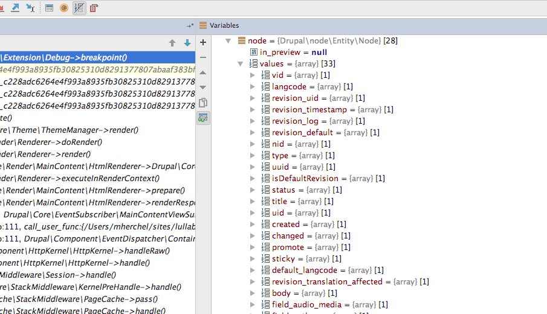

## Twig

### Basics
```twig
{# Prints Label #}
{{ label }}
```

```twig

 <!-- Markup here -->

```


### Inheritance

Extends syntax says what file it is extending

```twig

```
Then you define a block with all of the markup inside of it

```twig

  Markup and twig syntax goes here.

```

Then in the file that gets extended, you need to put a place where the file is getting dropped.

```twig

<div>
{{ content }}
</div>

```

namespaced paths

```

```

### Disable caching

Uncomment the following in settings.php and move it to the bottom of the file.

```php
if (file_exists($app_root . '/' . $site_path . '/settings.local.php')) {
  include $app_root . '/' . $site_path . '/settings.local.php';
}
```

Copy `example.settings.local.php` to `settings.local.php`.

Uncomment lines to disable render and local page caches.

Make your development.services.yml file like so:

```yaml
# Local development services.
#
# To activate this feature, follow the instructions at the top of the
# 'example.settings.local.php' file, which sits next to this file.
parameters:
  http.response.debug_cacheability_headers: true
  twig.config:
    debug: true
    auto_reload: true
    cache: false
services:
  cache.backend.null:
    class: Drupal\Core\Cache\NullBackendFactory
```

### Twig stuff

AddClass funtion to add CSS class to existing attributes

```twig
<div{{ attributes.addClass('banner') }}>
```

Filter to run string through the 't' function

```twig
{{ 'Home'|t }}
```

### Loops in twig

https://drupalize.me/tutorial/loops-and-iterators-twig?p=2512


```twig
<ul>
  
    <li>{{ item.content }} }} </li>
  
</ul>
```

Check something during the for loop

```twig
<ul>
  
    <li>{{ value.content }}</li>
  
</ul>
```

You can add an `else` statement in the for loop that will resolve if there are no items.

```twig
<ul>
  
    <li>{{ item.content }}</li>
  
    <li>This list is empty</li>
  
</ul>
```

You also have access to a `loop` variable within the loop.

* `loop.index`	The current iteration of the loop. (1 indexed)
* `loop.index0`	The current iteration of the loop. (0 indexed)
* `loop.revindex`	The number of iterations from the end of the loop (1 indexed)
* `loop.revindex0`	The number of iterations from the end of the loop (0 indexed)
* `loop.first`	True if first iteration
* `loop.last`	True if last iteration
* `loop.length`	The number of items in the sequence
* `loop.parent`	The parent context

```twig
<ul class='blog-post__tags field__items'>
  
    
      <li{{ item.attributes.addClass(['blog-post__tag', 'first']) }}>{{ item.content }}</li>
    
      <li{{ item.attributes.addClass(['blog-post__tag', 'last']) }}>{{ item.content }}</li>
    
      <li{{ item.attributes.addClass('blog-post__tag') }}>{{ item.content }}</li>
    

  
  </ul>
```

### Twig functions

```twig
{{ random() }}
```

```twig

 This will print if number is < 5

```

#### Drupal specific twig function

* `url` - generates absolute URL
* `path` - generates relative path
* `link` - create html link
* `file_url`
* `attach_library` - attaches library to template.

### Twig Filters

Uppercase the text

```twig
{{ product|upper }}
```

Uppercase then reverse text

```twig
{{ product|upper|reverse }}
```

* `length` Length of object or array or string ``

### Drupal Specific Filters

https://www.drupal.org/docs/8/theming/twig/filters-modifying-variables-in-twig-templates

* `t` - translate
* `drupal_escape`
* `clean_class`
* `clean_id`
* `format_date`
* `raw` dangerous
* `safe_join` The safe_join filter joins several strings together with a supplied separator. `{{ items|safe_join(', ') }}`
* `without`  creates a copy of the renderable array and removes child elements by key specified through arguments passed to the filter. `{{ content|without('links') }}`

### Twig Tests

https://twig.symfony.com/doc/1.x/

```twig

    ...

```

```twig

    the foo attribute really is the 'false' PHP value

```

### Debugger Breakpoints

Native to Twig:
```twig
{{ dump() }}

or

{{ dump(_context|keys) }}
```

`_context` references the current context and contains all variables passed to the template such as variables sent from theme(), prepared by preprocess, or set in the template. Adding {{ dump() }} without specifying a variable is equivalent to {{ dump(_context) }}.

with Devel module:

```twig
{{ devel_breakpoint() }}
```

From here, look into the `$context` variable.

when translating items to the twig file, ignore `$content['elements']`. Start from `[content]`.

### Add classes in Drupal twig

* Printing `<div{{ attributes }}>` works fine.
* Don't add additional spacing in the attributes.
* Add class
```twig
<article{{ attributes.addClass('mikeclass') }}>
```
* Remove class
```twig
<div{{ attributes.removeClass('their-class') }}>
```
* Remove class via set adn ternary operator
```twig

```
* add attribute
```twig
<div{{ attributes.setAttribute('data-bundle', node.bundle) }}>
```
* Check if attribute exists
```twig

  {# do stuff #}

```
* Add multiple classes:
```twig

<article{{ attributes.addClass(classes) }}>
```

## Twig Notes

You can reference the path to the theme with

```twig
{{ base_path ~ directory }}
```

Concatenate strings with a `~`

```twig
{{ base_path ~ directory }}
```

## Preprocess function notes

Use `themename.theme` for the file.

Function is in format of `function THEME_preprocess_HOOK()`. Get the hook from twig debug mode.


You can also use `function THEME_preprocess(&$variables, $hook)`. This is useful if you want to inject a variable into every template.

Use render arrays instead of hardcoding html

```php
function icecream_preprocess_node(&$variables) {
  $variables['simple_string'] = array(
    '#markup' => 'A simple string',
  );
}
```

```twig
<div class="string">
 {{ simple_string }}
</div>
```

## Render API

1. Structured arrays with data and hints on how to render it.
2. Pipeline: process Drupal goes through to serve a request.

### Render Arrays

* Properties are array items where the key's names start with a hash. They determine how an instance of an element will ultimately be rendered.
* Elements are items that do _not_ start with a hash. They can have children. It's an individual section of the array and represent data.

* `#markup` Provides HTML directly
* `#theme` Provides information on which template is needed to generate the HTML (and where to find it).
* `#type` Shorthand for writing a more complex element.

#### Value properties

Store strings, integers, booleans, arrays. Examples:

* `#prefix`
* `#suffix`
* `#title`
* `#weight`

#### Callable properties

Less common. These hold references to PHP callables. At specific points in the rendering, these can be called to alter the state.

* `#pre_render`
* `#post_render`

## Composer

- `composer install` - initial install. If a `composer.lock` file exists, it will ignore the `package.json` and use the lock file.
- `composer update` - Updates with the latest tags off of the `package.json` file.
  - You can use `composer update [package]` to only update a single package.
- `composer require` - installs new package (or module), and writes it to the `package.json`.

## Tips

* Strip HTML tags with `{{ content.field_first_name|render|striptags }}`
* Loop through field that has multiple values, and affect markup with
```twig

  <li>{{ interest }}</li>

```
* Add jQuery and Drupal behaviors to themename.libraries.yml
```yaml
base:
  version: 1.0
  css:
    theme:
      css/styles.css: { weight: 10 }
  js:
    js/scripts.js: {}
  dependencies:
    - core/jquery
    - core/drupal
```
Note the `- core/drupal` line is necessary to include `drupal.js` which processes Drupal behaviors.

### Built in CSS classes

[See the change record](https://www.drupal.org/node/2022859)

* `hidden` - Does a `display: none;`
* `visually-hidden` - Hides visually, but reachable via screen reader
* `visually-hidden focusable` - Same as above but focusable.
* `invisible` - does a `visibility: hidden;`


### Include a twig template file

Note that the `@theme_name` points to the _templates_ directory within the `theme_name` theme!

```twig

```

It's good practice to prefix your templates with an underscore.


## Printing out Unix date, NID, sticky, etc

There's a bunch of `getXXX` methods under the node object that are not viewable while PHP debugging. You can call these with `{{ node.XXX.value }}`.



Examples include

* Created date - `{{ node.created.value }}`
* Updated date - `{{ node.updated.value }}`
* Node ID - `{{ node.nid.value }}`
* UID - `{{ node.uid.value }}`
* Status - `{{ node.status.value }}`
* Node Type - `{{ node.type.value }}`

## Multiple ways to check if field exists in twig

Normally you can get away with

```twig

  <div class="field">
    {{ content.field }}
  </div>

```

If that doesn't work you can render it

```twig

  <div class="field">
    {{ content.field }}
  </div>

```

You can also check the node object, which has the `getValue()` method, which can be reference in twig by `{{ node.field.value }}`. This has the added benefit of not using the field template (and associated markup).

```twig

  <div class="field">
    {{ node.field.value }}
  </div>

```

If needed you can strip tags and trim it after render

```twig

  <div class="field">
    {{ content.field }}
  </div>

```

You can also use twig syntax similar to the following if needed

```twig

```
