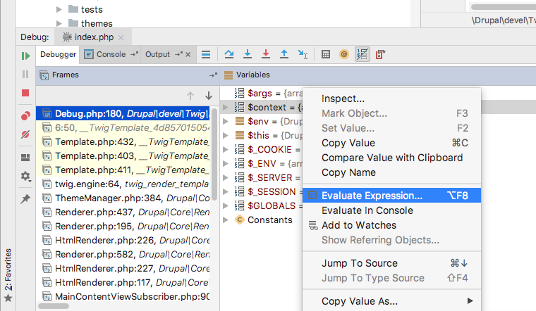

## Twig

### Basics
```twig
{# Prints Label #}
{{ label }}
```

```twig

 <!-- Markup here -->

```
Multiple conditions:
```twig

 <!-- Markup here -->

```

### Ternary Operators in twig

Only adds the `has-content-right` if the `page.content_right` region has content.

```twig
<div class="layout-container {{ page.content_right ? 'has-content-right'}}">
```

You can also add the else statement, which evaluates if the condition is false:
```twig
<div class="layout-container {{ page.content_right ? 'has-content-right': 'no-content-right'}}">
```


### Inheritance

Extends syntax says what file it is extending

```twig

```
Then you define a block with all of the markup inside of it

```twig

  Markup and twig syntax goes here.

```

Then in the file that gets extended, you need to put a place where the file is getting dropped.

```twig

<div>
{{ content }}
</div>

```

namespaced paths

```

```

### Disable caching

Uncomment the following in settings.php and move it to the bottom of the file.

```php
if (file_exists($app_root . '/' . $site_path . '/settings.local.php')) {
  include $app_root . '/' . $site_path . '/settings.local.php';
}
```

Copy `example.settings.local.php` to `settings.local.php`.

Verify the following lines are uncommented to disable render and local page caches.
```php
$config['system.performance']['css']['preprocess'] = FALSE;
$config['system.performance']['js']['preprocess'] = FALSE;
```

Make your `development.services.yml` file like below. This file is already enabled within the `settings.local.php` that you've just enabled.

```yaml
# Local development services.
#
# To activate this feature, follow the instructions at the top of the
# 'example.settings.local.php' file, which sits next to this file.
parameters:
  http.response.debug_cacheability_headers: true
  twig.config:
    debug: true
    auto_reload: true
    cache: false
services:
  cache.backend.null:
    class: Drupal\Core\Cache\NullBackendFactory
```

### Twig stuff

AddClass funtion to add CSS class to existing attributes

```twig
<div{{ attributes.addClass('banner') }}>
```

Filter to run string through the 't' function

```twig
{{ 'Home'|t }}
```

### Loops in twig

https://drupalize.me/tutorial/loops-and-iterators-twig?p=2512


```twig
<ul>
  
    <li>{{ item.content }} }} </li>
  
</ul>
```

Check something during the for loop

```twig
<ul>
  
    <li>{{ value.content }}</li>
  
</ul>
```

You can add an `else` statement in the for loop that will resolve if there are no items.

```twig
<ul>
  
    <li>{{ item.content }}</li>
  
    <li>This list is empty</li>
  
</ul>
```

You also have access to a `loop` variable within the loop.

* `loop.index`	The current iteration of the loop. (1 indexed)
* `loop.index0`	The current iteration of the loop. (0 indexed)
* `loop.revindex`	The number of iterations from the end of the loop (1 indexed)
* `loop.revindex0`	The number of iterations from the end of the loop (0 indexed)
* `loop.first`	True if first iteration
* `loop.last`	True if last iteration
* `loop.length`	The number of items in the sequence
* `loop.parent`	The parent context

```twig
<ul class='blog-post__tags field__items'>
  
    
      <li{{ item.attributes.addClass(['blog-post__tag', 'first']) }}>{{ item.content }}</li>
    
      <li{{ item.attributes.addClass(['blog-post__tag', 'last']) }}>{{ item.content }}</li>
    
      <li{{ item.attributes.addClass('blog-post__tag') }}>{{ item.content }}</li>
    

  
  </ul>
```

### Twig functions

```twig
{{ random() }}
```

```twig

 This will print if number is < 5

```

#### Drupal specific twig function

* `url` - generates absolute URL
* `path` - generates relative path
* `link` - create html link
* `file_url`
* `attach_library` - attaches library to template.

### Twig Filters

Uppercase the text

```twig
{{ product|upper }}
```

Uppercase then reverse text

```twig
{{ product|upper|reverse }}
```

* `length` Length of object or array or string ``

### Drupal Specific Filters

https://www.drupal.org/docs/8/theming/twig/filters-modifying-variables-in-twig-templates

* `t` - translate
* `drupal_escape`
* `clean_class`
* `clean_id`
* `format_date`
* `raw` dangerous
* `render` Useful for when chaining the `trim` filter after it, or for when checking if the value exists.
* `safe_join` The safe_join filter joins several strings together with a supplied separator. `{{ items|safe_join(', ') }}`
* `without`  creates a copy of the renderable array and removes child elements by key specified through arguments passed to the filter. `{{ content|without('links') }}`

### Twig Tests

https://twig.symfony.com/doc/1.x/

```twig

    ...

```

```twig

    the foo attribute really is the 'false' PHP value

```

### Debugger Breakpoints

Native to Twig:
```twig
{{ dump() }}

or

{{ dump(_context|keys) }}
```

`_context` references the current context and contains all variables passed to the template such as variables sent from theme(), prepared by preprocess, or set in the template. Adding {{ dump() }} without specifying a variable is equivalent to {{ dump(_context) }}.

with Devel module:

```twig
{{ devel_breakpoint() }}
```

From here, look into the `$context` variable.

when translating items to the twig file, ignore `$content['elements']`. Start from `[content]`.

### Add classes in Drupal twig

* Printing `<div{{ attributes }}>` works fine.
* Don't add additional spacing in the attributes.
* Add class
```twig
<article{{ attributes.addClass('mikeclass') }}>
```
* Remove class
```twig
<div{{ attributes.removeClass('their-class') }}>
```
* Remove class via set adn ternary operator
```twig

```
* add attribute
```twig
<div{{ attributes.setAttribute('data-bundle', node.bundle) }}>
```
* Check if attribute exists
```twig

  {# do stuff #}

```
* Add multiple classes:
```twig

<article{{ attributes.addClass(classes) }}>
```

## Twig Notes

You can reference the path to the theme with

```twig
{{ base_path ~ directory }}
```

Concatenate strings with a `~`

```twig
{{ base_path ~ directory }}
```

## Preprocess function notes

Use `themename.theme` for the file.

Function is in format of `function THEME_preprocess_HOOK()`. Get the hook from twig debug mode.


You can also use `function THEME_preprocess(&$variables, $hook)`. This is useful if you want to inject a variable into every template.

Use render arrays instead of hardcoding html

```php
function icecream_preprocess_node(&$variables) {
  $variables['simple_string'] = array(
    '#markup' => 'A simple string',
  );
}
```

```twig
<div class="string">
 {{ simple_string }}
</div>
```

## Render API

1. Structured arrays with data and hints on how to render it.
2. Pipeline: process Drupal goes through to serve a request.

### Render Arrays

* Properties are array items where the key's names start with a hash. They determine how an instance of an element will ultimately be rendered.
* Elements are items that do _not_ start with a hash. They can have children. It's an individual section of the array and represent data.

* `#markup` Provides HTML directly
* `#theme` Provides information on which template is needed to generate the HTML (and where to find it).
* `#type` Shorthand for writing a more complex element.

#### Value properties

Store strings, integers, booleans, arrays. Examples:

* `#prefix`
* `#suffix`
* `#title`
* `#weight`

#### Callable properties

Less common. These hold references to PHP callables. At specific points in the rendering, these can be called to alter the state.

* `#pre_render`
* `#post_render`

## Composer

- `composer install` - initial install. If a `composer.lock` file exists, it will ignore the `package.json` and use the lock file.
- `composer update` - Updates with the latest tags off of the `package.json` file.
  - You can use `composer update [package]` to only update a single package.
- `composer require` - installs new package (or module), and writes it to the `package.json`.

## Tips

* Strip HTML tags with `{{ content.field_first_name|render|striptags }}`
  * You can also try using the node object with the `getValue()` method. That looks like {{ node.field_first_name.value }}. This shouldn't use the field template.
* Loop through field that has multiple values, and affect markup with
```twig

  <li>{{ interest }}</li>

```
* Add jQuery and Drupal behaviors to themename.libraries.yml
```yaml
base:
  version: 1.0
  css:
    theme:
      css/styles.css: { weight: 10 }
  js:
    js/scripts.js: {}
  dependencies:
    - core/jquery
    - core/drupal
```
Note the `- core/drupal` line is necessary to include `drupal.js` which processes Drupal behaviors.

### Built in CSS classes

[See the change record](https://www.drupal.org/node/2022859)

* `hidden` - Does a `display: none;`
* `visually-hidden` - Hides visually, but reachable via screen reader
* `visually-hidden focusable` - Same as above but focusable.
* `invisible` - does a `visibility: hidden;`


### Include a twig template file

Note that the `@theme_name` points to the _templates_ directory within the `theme_name` theme!

```twig

```

It's good practice to prefix your templates with an underscore.


## Printing out Unix date, NID, sticky, etc

There's a bunch of `getXXX` methods under the node object that are not viewable while PHP debugging. You can call these with `{{ node.XXX.value }}`.


Examples include

* Created date - `{{ node.created.value }}`
* Updated date - `{{ node.updated.value }}`
* Node ID - `{{ node.nid.value }}`
* UID - `{{ node.uid.value }}`
* Status - `{{ node.status.value }}`
* Node Type - `{{ node.type.value }}`

## Multiple ways to check if field exists in twig

Sometimes doing a simple `` doesn't correctly check. There's an 8 year old (!!!) issue on Drupal.org ([link](https://www.drupal.org/project/drupal/issues/953034)) that details the issues. [Mark Carver's comment](https://www.drupal.org/project/drupal/issues/953034?page=1#comment-12448143) provides some insight on why this is not yet fixed.

In the meantime, there are multiple ways to do conditionals, that will work around this bug.

This is the normal way to do things.

```twig

  <div class="field">
    {{ content.field }}
  </div>

```

If that doesn't work you can render it

```twig

  <div class="field">
    {{ content.field }}
  </div>

```

You can also check the node object, which has the `getValue()` method, which can be reference in twig by `{{ node.field.value }}`. This has the added benefit of not using the field template (and associated markup).

```twig

  <div class="field">
    {{ node.field.value }}
  </div>

```

If needed you can strip tags and trim it after render

```twig

  <div class="field">
    {{ content.field }}
  </div>

```

You can also use twig syntax similar to the following if needed

```twig

```

## Getting fields (and entity reference fields) within preprocess

Thanks to [Marcos Cano](https://www.lullabot.com/about/marcos-cano) for helping me out with all of this!

When debugging in PHPStorm, it's really useful to use the watches panel. This is similar to the watches panel in Chrome DevTools and does the same things. Prior to this, I was using PHPStorm's console tab, but that didn't always work!

Once stopped at a breakpoint, open up the watches tab using the little glasses icon.



You can get access to all of the fields by using Entity API Methods.

First load up the node object (note I didn't yet test this code)

```php
$variables['node']
```

Then do a `getFields()` on it to see the fields

```php
$variables['node']->getFields();
```

You'll see an array of stuff including fields.

From there you can use the `get()` method to get the field

```php
$variables['node']->get('field_firstname');
```

_but_ you can also use what Marcos Cano called _magic_ by using the fieldname as the method. It makes things more readable.

```php
$variables['node']->field_firstname;
```
From there you can try a couple different things based on the field type. Sometimes you can get the value by doing
```php
$variables['node']->field_firstname->getValue();
```
A lot of times, you can browse down the object, and look for the key that holds the actual data that you're looking for.

This might be `uri` if it's a _link_ field. Or, it might be `value` if it's a _text_ field. Expand the array in the watch expression and take a look.

```php
// a link field might look like
$variables['node']->field_firstname->uri;
// or if its a text field
$variables['node']->field_firstname->value;
```

### Loading field from an entity reference.

You'll probably need to load some data from an entity reference. Here's how to do it.

Use the above methods to bring up the field for the reference:

```php
$variables['node']->field_reference
```

Then you need to open the `entity` object(?). This won't show when you're looking in the watches panel for whatever reason.

```php
$variables['node']->field_reference->entity
```

From there you can use the same methods to access the data as we did before.

```php
$variables['node']->field_reference->entity->field_firstname->value
```

And you can even go into different entity references. Here's an example that I worked with. It's a reference to another node, that has a reference to a file!

```php
$variables['node']->field_parent->entity->field_show_media->entity->field_media_image->entity->uri->value
```

## Theming views output

You may have noticed that Twig debug mode does not output the template suggestions for views twig templates. [The issue](https://www.drupal.org/project/drupal/issues/2118743) is currently postponed, so it probably won't be fixed until 8.8 or 8.7 at the earliest.

Never fear though! Views template suggestions work similar to what they did in D7.

### Views twig templates naming
* Display output: `views-view.html.twig`, `views-view--VIEWNAME.html.twig`, `views-view--attachment.html.twig`, `views-view--VIEWNAME--attachment.html.twig`, `views-view--DISPLAYNAME.html.twig`, `views-view--VIEWNAME--DISPLAYNAME.html.twig`, `views-view--default.html.twig`, `views-view--default.html.twig`, `views-view--DISPLAYNAME-1.html.twig`, `views-view--VIEWNAME--DISPLAYNAME-1.html.twig`
* Style output: `views-view-unformatted.html.twig`, `views-view-unformatted--VIEWNAME.html.twig`, `views-view-unformatted--DISPLAYNAME.html.twig`, `views-view-unformatted--VIEWNAME--DISPLAYNAME.html.twig`, `views-view-unformatted--default.html.twig`, `views-view-unformatted--default.html.twig`, `views-view-unformatted--DISPLAYNAME-1.html.twig`, `views-view-unformatted--VIEWNAME--DISPLAYNAME-1.html.twig`
* Row style output: `views-view-fields.html.twig`, `views-view-fields--VIEWNAME.html.twig`, `views-view-fields--DISPLAYNAME.html.twig`, `views-view-fields--VIEWNAME--DISPLAYNAME.html.twig`, `views-view-fields--default.html.twig`, `views-view-fields--default.html.twig`, `views-view-fields--DISPLAYNAME-1.html.twig`, `views-view-fields--VIEWNAME--DISPLAYNAME-1.html.twig`
* Field Content: `views-view-field.html.twig`, `views-view-field--FIELDNAME.html.twig`, `views-view-field--VIEWNAME.html.twig`, `views-view-field--VIEWNAME--FIELDNAME.html.twig`, `views-view-field--DISPLAYNAME.html.twig`, `views-view-field--DISPLAYNAME--FIELDNAME.html.twig`, `views-view-field--VIEWNAME--DISPLAYNAME.html.twig`, `views-view-field--VIEWNAME--DISPLAYNAME--FIELDNAME.html.twig`, `views-view-field--DISPLAYNAME-1.html.twig`, `views-view-field--DISPLAYNAME-1--FIELDNAME.html.twig`, `views-view-field--VIEWNAME--DISPLAYNAME-1.html.twig`, `views-view-field--VIEWNAME--DISPLAYNAME-1--FIELDNAME.html.twig`


When in doubt, fire up a D7 site, and go into the theming section of the view, and see the template suggestions there.

## Cachability and Twig

Drupal 8 has a new caching system that really sets above from other systems. However there's a ~bug~ [idiosyncrasy](https://www.drupal.org/project/drupal/issues/2660002) in the way twig templates handle caching.

If you're *not* printing out your templates with the `{{ content }}` variable. Say

```twig
<div{{ attributes }}>
  {{ content.first_name }} {{ content.last_name }}
</div>
```
the *cacheable metadata* won't be included. This means that if your data changes within the database, the theming system won't know to show the newer data.

The temporary fix is straightforward, add the following line to the bottom of you twig file:

```twig

```
Thanks to Avi Schwab for [f]inding this solution](https://www.drupal.org/project/drupal/issues/2660002#comment-12361402) and Mark Conroy for putting it [somewhere I actually noticed it](https://mark.ie/blog/web-development/creating-card-component-patternlab-and-mapping-drupal-right-way).
