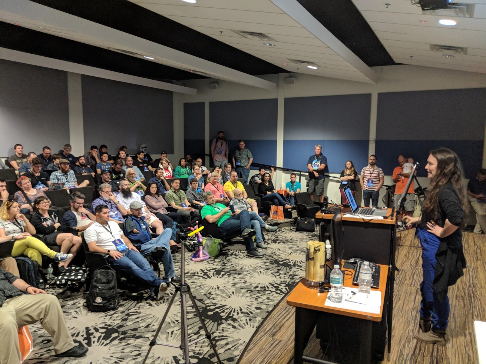
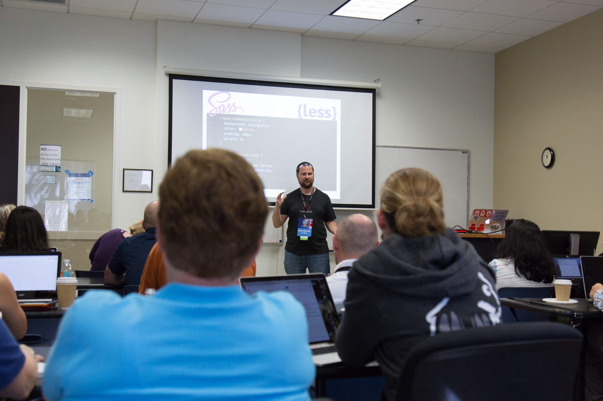
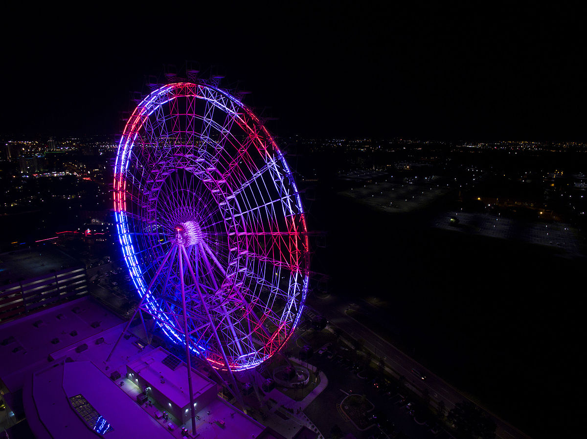
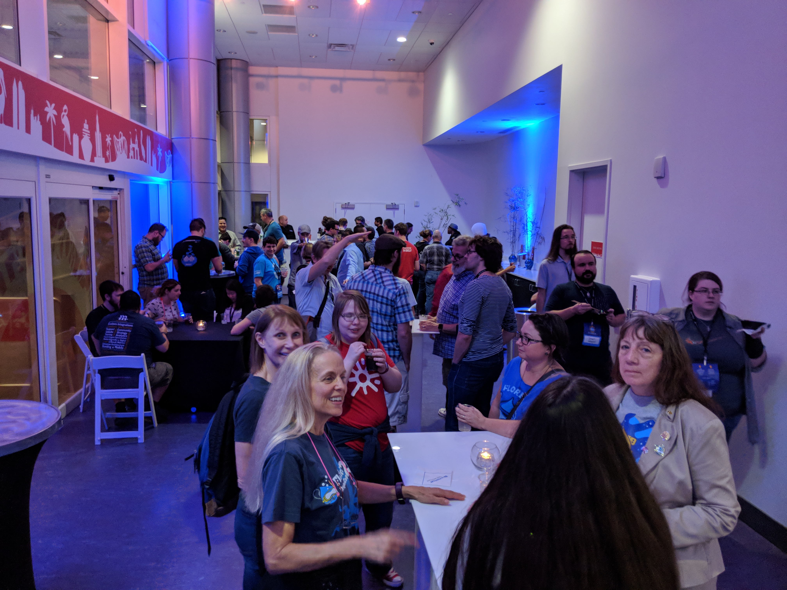
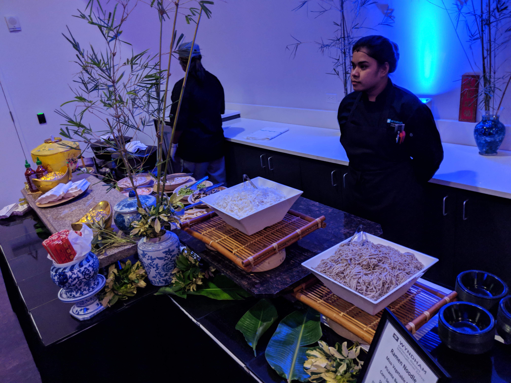
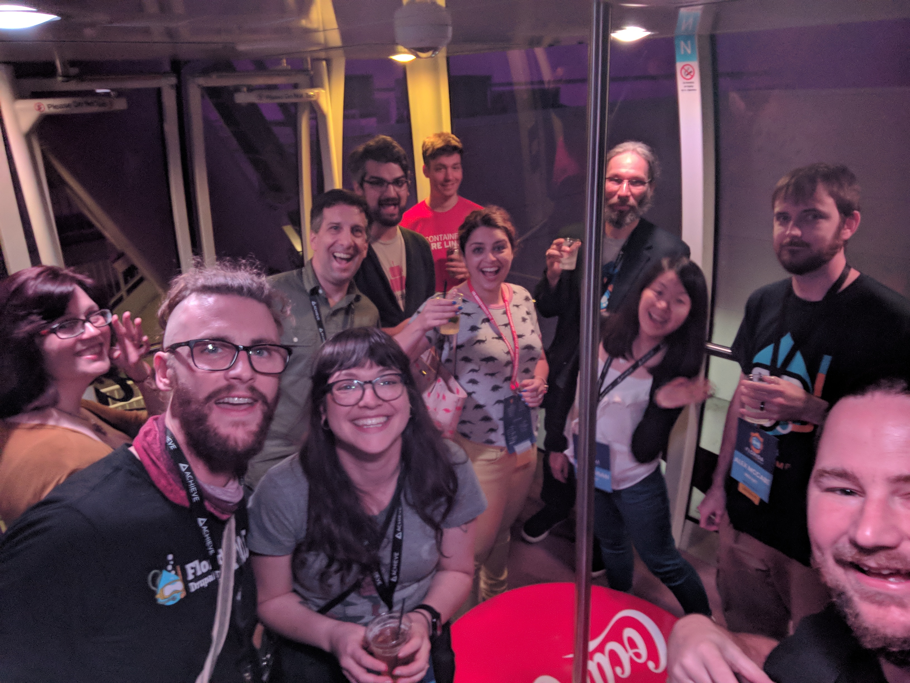
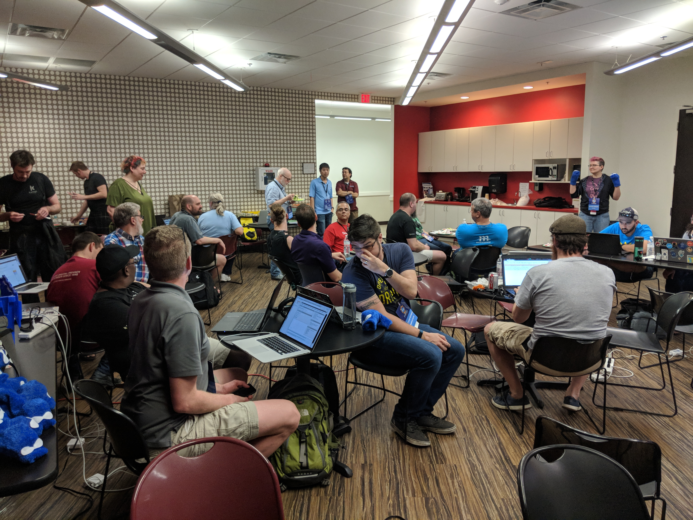

This year's [Florida Drupalcamp 2018](https://www.fldrupal.camp/) was the tenth anniversary of the conference... and it was amazing. We have an amazing group of volunteers and every year the conference keeps getting smoother.

<blockquote class="twitter-tweet" data-lang="en">
I’m very impressed with how smoothly <a href="https://twitter.com/fldrupalcamp?ref_src=twsrc%5Etfw">@fldrupalcamp</a> went. Kudos to the organizers and volunteers!
&mdash; Rick Manelius, PhD (@rickmanelius) <a href="https://twitter.com/rickmanelius/status/965541696577703937?ref_src=twsrc%5Etfw">February 19, 2018</a></blockquote>

<blockquote class="twitter-tweet" data-lang="en">
I&#39;d also like to thank the <a href="https://twitter.com/hashtag/fldc18?src=hash&amp;ref_src=twsrc%5Etfw">#fldc18</a> lead organizers - <a href="https://twitter.com/ultimike?ref_src=twsrc%5Etfw">@ultimike</a>, <a href="https://twitter.com/mikeherchel?ref_src=twsrc%5Etfw">@mikeherchel</a> and <a href="https://twitter.com/Ky1eTH?ref_src=twsrc%5Etfw">@Ky1eTH</a>, along with all the volunteers, the catering staff for their delicious food, and the location for working out really well. Just a wonderful day.
&mdash; Damien McKenna (@DamienMcKenna) <a href="https://twitter.com/DamienMcKenna/status/965063049332908033?ref_src=twsrc%5Etfw">February 18, 2018</a></blockquote>

<blockquote class="twitter-tweet" data-lang="en">
Goodbye <a href="https://twitter.com/fldrupalcamp?ref_src=twsrc%5Etfw">@fldrupalcamp</a>, hello Wisconsin! It was a great camp. Amazing people. Hopefully it isn&#39;t another four years before I&#39;m back
&mdash; Matt Glaman (@nmdmatt) <a href="https://twitter.com/nmdmatt/status/965350386277240837?ref_src=twsrc%5Etfw">February 18, 2018</a></blockquote>

<blockquote class="twitter-tweet" data-lang="en">
<a href="https://twitter.com/fldrupalcamp?ref_src=twsrc%5Etfw">@fldrupalcamp</a> was amazing this year. Great people, content, and collaboration. Great job <a href="https://twitter.com/ultimike?ref_src=twsrc%5Etfw">@ultimike</a> <a href="https://twitter.com/mikeherchel?ref_src=twsrc%5Etfw">@mikeherchel</a> and <a href="https://twitter.com/Ky1eTH?ref_src=twsrc%5Etfw">@Ky1eTH</a>
&mdash; Adam Bergstein (@n3rdstein) <a href="https://twitter.com/n3rdstein/status/965308263909724160?ref_src=twsrc%5Etfw">February 18, 2018</a></blockquote>

## So, what is Florida Drupalcamp?

[Florida Drupalcamp](https://fldrupal.camp) is the most attended Drupal conference in the southeastern United States!

<figure border>
    
    <figcaption>View of the auditorium during lightning talks.</figcaption>
</figure>

Every February, approximately 250 web development professionals gather in Orlando to learn, talk about, and contribute to the [Drupal content management system](https://drupal.org) alongside other web development technologies. 2018 marks the 10th year the conference has been in existence, and it marks my 7th year volunteering (with 6 of those as a core organizer).

The conference is funded mostly by [sponsors](https://www.fldrupal.camp/sponsors), which allows us to charge very little for a ticket (only $35). The ticket includes *three days* of trainings, sessions, and contribution sprints. 

The sponsor funding allows us to fly in three featured speakers from across the globe, provide catered food every day, pay to get the sessions recorded, and also provide swag such as tshirts, coozies, stickers, etc.

## My session on "The New Styles"

This year I put together a new session on modern CSS techniques focusing on CSS Custom Properties and CSS Grid layout. 

<figure border>
    
    <figcaption>Presenting at Florida Drupalcamp. <a href="https://www.designzillas.com/blog/drupalcamp-2018" target="_blank">Image by Leisy Vidal</a>.</figcaption>
</figure> 

I presented my session to a full room (including some people sitting on the floor), and it went pretty well. I wasn't able to get through all of my content within the 45 minute slot, but I did take time to answer attendee questions and make sure people understand the core concepts.

<blockquote class="twitter-tweet" data-lang="en">
Full room for <a href="https://twitter.com/mikeherchel?ref_src=twsrc%5Etfw">@mikeherchel</a> - we are expecting some greatness. No pressure :) <a href="https://twitter.com/fldrupalcamp?ref_src=twsrc%5Etfw">@fldrupalcamp</a> <a href="https://twitter.com/hashtag/FLDC18?src=hash&amp;ref_src=twsrc%5Etfw">#FLDC18</a> <a href="https://t.co/3p9qE6EAMA">pic.twitter.com/3p9qE6EAMA</a>
&mdash; jordana_f (@jordana_f) <a href="https://twitter.com/jordana_f/status/964892119679799298?ref_src=twsrc%5Etfw">February 17, 2018</a></blockquote>

<blockquote class="twitter-tweet" data-lang="en">
We&#39;re currently working through some <a href="https://twitter.com/hashtag/CSS?src=hash&amp;ref_src=twsrc%5Etfw">#CSS</a> variables, grid layouts, and fr units in <a href="https://twitter.com/mikeherchel?ref_src=twsrc%5Etfw">@mikeherchel</a>&#39;s <a href="https://twitter.com/hashtag/FLDC18?src=hash&amp;ref_src=twsrc%5Etfw">#FLDC18</a> training session. <a href="https://twitter.com/hashtag/drupal?src=hash&amp;ref_src=twsrc%5Etfw">#drupal</a> <a href="https://twitter.com/hashtag/webdevelopment?src=hash&amp;ref_src=twsrc%5Etfw">#webdevelopment</a> <a href="https://t.co/CaA4BYQRUS">pic.twitter.com/CaA4BYQRUS</a>
&mdash; designzillas (@designzillas) <a href="https://twitter.com/designzillas/status/964903155124310017?ref_src=twsrc%5Etfw">February 17, 2018</a></blockquote>

My presentation was recorded and you can [view it here](https://www.fldrupal.camp/sessions/design-theming-front-end-development/new-styles-evolving-your-stylesheets-modern-web).

## Saturday's After Party

Being our tenth anniversary, we tried to do it big this year. 

Our first thought was to make the afterparty awesome. 

 * Mike Anello had the idea to take attendees out to Bithlo to watch *figure 8 school bus racing* (we were going to have a Druplicon painted on one of the busses). But they didn’t get back to us.

 * Then we were going to bus attendees to the Kennedy Space Center and rent the space under the Space Shuttle. But that was going to cost around $17,000 and that was too much!

 * We then had the thought to do the Orlando Eye, which is the big ferris wheel off of I-Drive in Orlando. This worked out great, although we could only fit in 100 people. 

The afterparty went wonderfully. We had a dedicated area all to ourself. 

<figure>
    
    <figcaption>The FLDC afterparty</figcaption>
</figure>

<figure>
    
    <figcaption>We had a ramen bar!</figcaption>
</figure>

<figure>
    
    <figcaption>We rode the ferris wheel!</figcaption>
</figure>

## Sunday's Contribution Sprints

The second half of Sunday was contribution sprints. Drupal is free open source software, which means that anyone can contribute code.

We flew in several mentors this year to help with the organizing. 

<figure>
    
    <figcaption>Florida Drupalcamp Contribution Sprints</figcaption>
</figure>

I put together a team that fixed some Internet Explorer 11 issues for Drupal core's new Umami theme. You can [read the issue and view the patches here](https://www.drupal.org/project/drupal/issues/2943107).