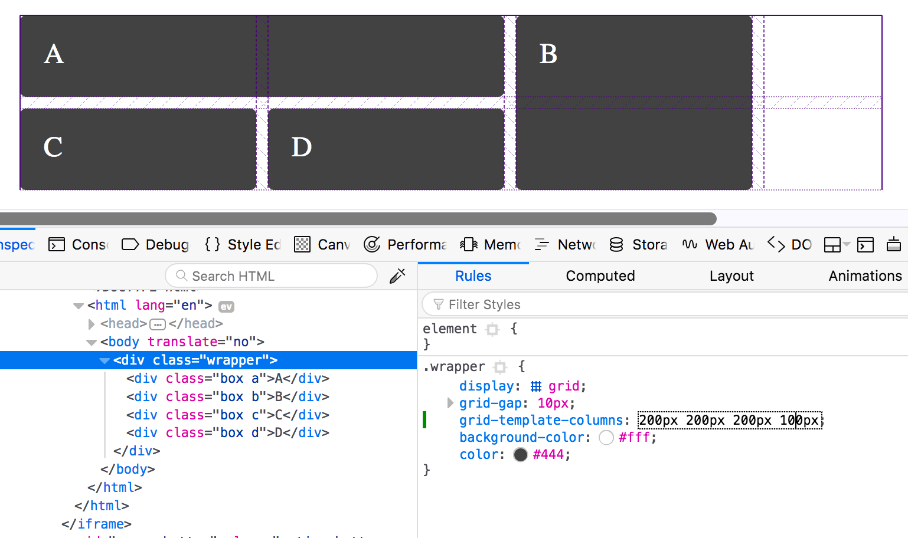
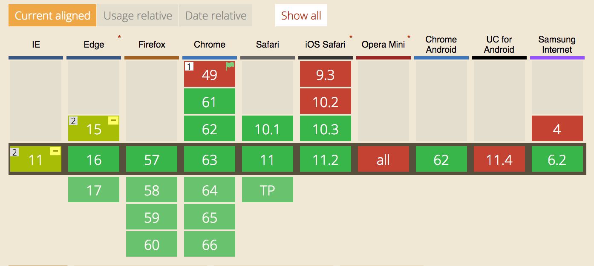

One of the best ways for anyone to learn a topic is to teach that topic. To that end, I'm giving a presentation for my [local front-end development meetup](https://www.meetup.com/Gainesville-Front-End-Dev-Meetup/events/246457734/) this week. In preparation, I'm writing this CSS cheat sheet / blog.

Before we start, let's recite the *CSS Grid Cheat Sheet Creed*.

> This is my CSS Grid cheat sheet. There are many like it, but this one is mine. My cheat sheet is my best friend. It is my life. I must master it as I must master my life. Without me, my cheat sheet is useless. Without my cheat sheet, I am useless...

## My Background

I've been doing web development for a long time (since 2001), and am familiar with most of the web's underlying technologies.

I'm a big believer in not adding unneeded complexity, so I typically shy away from traditional grid systems such as [Susy](http://oddbird.net/susy/), [Singularity](https://github.com/at-import/Singularity), and [Bootstrap](https://getbootstrap.com/docs/4.0/layout/grid/) &mdash; *unless* the design is very grid centric. 

My traditional approach to layout has been set the `width` to a percentage value &mdash; lets say `94%`, and then set the `max-width` of the container to something like `1200px` or whatever the design calls for. Then I can layout the internal structure through flexbox or floats, using a combination of percentages, pixels, and the CSS `calc()` function.

## Tips on getting started with grid

CSS Grid is pretty easy once you get started with it, but just like CSS, it gets more complicated the deeper you dive. The good news is that you don't need to dive very deep to reach some awesome power. For what it's worth, I think Grid is easier to learn than was flexbox.

As with any new syntax, I highly recommend having (or better yet, creating) a cheat sheet for quick reference. Although I created this blog post, there are many other great resources.

* [CSS Tricks: A Complete Guide to Grid](https://css-tricks.com/snippets/css/complete-guide-grid/)
* [Interactive CSS Grid Playground](https://alialaa.github.io/css-grid-cheat-sheet/)
* [Codrops CSS Grid Reference](https://tympanus.net/codrops/css_reference/grid/)

I also highly recommend [Rachel Andrew's](https://twitter.com/rachelandrew) website, [Grid by Example](https://gridbyexample.com), which has a plethora of common use cases, and an *excellent* free [video series](https://gridbyexample.com/video/) to get you up and running.

Now let's get to the meat and potatoes of this post... the syntax.

## Grid Container Syntax

First, we'll start with the syntax of the grid container.

### Initialize CSS Grid

```css
.grid {
  display: grid;
}
```

### Set up columns

This sets up three 200px columns.

```css
.grid {
  grid-template-columns: 200px 200px 200px;
}
```

### Set up rows

Similarly,` grid-template-rows` sets up your rows.
```css
.grid {
  /* Set up three 200px rows */
  grid-template-rows: 200px 200px 200px;
  /* The auto keyword is equal to the maximum height of the content. */
  grid-template-rows: auto auto auto;
}
```

### Repeat syntax
You can accomplish the same thing by using *repeat syntax*. This also creates three 200px columns.

```css
.grid {
  grid-template-columns: repeat(3, 200px);
}
```

You can mix and match the regular syntax and repeat syntax. This example creates one 300px column, and three 200px columns.

```css
.grid {
  grid-template-columns: 300px repeat(3, 200px);
}
```

### Grid Gap

Instead of margins, you specify the gap between grid children with the `grid-gap`, `grid-row-gap`, and `grid-column-gap` properties.

```css
.grid {
  grid-gap: 20px; /* All rows and columns will have 20px gap. */
  grid-gap: 20px 40px; /* Columnns will have 20px gap. Rows will have 40px gap. */
  
  grid-row-gap: 2vw; /* Now rows will have a 2vw (viewport width units) gap. */
  grid-column-gap: 10%; /* Columns will have 10% gap between them. */
}
```

### MinMax syntax

`minmax` allows you to set a minimum and maximum width of your columns. Doing so helps you avoid using media queries. You can use `minmax` inside of `repeat`.

```css
.grid {
  grid-template-columns: 200px repeat(3, minmax(100px, 200px));
}
```

### FR unit

The "fr" in the `fr` unit stands for *fraction*. Grid will create an amount of identical width units equal to the sum of all the `fr` units in the row, and then it will assign the width of each column based on how many `fr` units are assigned to it.

So, if I have a three columns that each have `1fr` width, they will each be 33.33% wide. If they each have `2fr`, their width will be the same because they're still all equal to each other.

If the first column is `2fr` and the next two columns are each `1fr`, then the first column will take up 50%, and the next two will each take up 25%.

```css
.grid {
  /* Each of the three columns will take up 33.33% width. */
  grid-template-columns: repeat(3, 1fr);

  /* Each of the three columns will still take up 33.33% width because they're all equal. */
  grid-template-columns: repeat(3, 2fr);

  /* The first column will take up 50% of the width, and the other columns will each take up 25% width. */
  grid-template-columns: 2fr repeat(2, 1fr);
}

```

### Autofill property

`autofill` automatically adds columns to the grid layout according to the container width. The example below will create 5 200px columns. Note that these columns can be empty if elements don't exist to fill them in.

```css
.grid {
  width: 1000px;
  grid-template-columns: repeat(autofill, 200px);
}
```

### Autofill + minmax + fr units = Awesome!

The syntax below will automatically create as many 200px columns in the row as possible. But, once it cannot fit any more in, it'll stretch each column out equally to fill out the entire width of the container! 😎

```css
.grid {
  grid-template-columns: repeat(autofill, minmax(200px, 1fr));
}
```

### grid-auto-rows and grid-auto-columns

`grid-auto-rows` and `grid-auto-columns` specify the height (track size) of the auto-generated columns and rows. This can be in in any unit including `fr`. The initial value for these properties is `auto`, which sets the height equal to the largest content item.

```css
.grid {
  /* All auto-generated rows will have 30px height */
  grid-auto-rows: 30px;
}
```

### Masonry layout using grid

If you have grid elements that are taking up multiple columns and/or rows, you can encounter situations where "holes" in the grid appear.

You can fix this by using `grid-auto-flow: dense;`. Note that this will cause the elements to appear out of the original source order.

```css
.grid {
  /* Enable masonry like layout */
  grid-auto-flow: dense;
}
```

### Align tracks within a grid

A track is either a column or a row. What if the grid is wider or higher than your grid tracks? How do you control where the tracks go?

You can use our old flexbox friends `justify-content` and `align-content`! The values to use are `start`, `center`, and `end`.

```css
.grid {
  display: grid;
  width: 1000px; /* Explicit width */
}

.grid-child {
  grid-template-columns: repeat(3, 300px); /* Note that there'll be an extra 100px left over */
  justify-content: end; /* This will align the columns to the right. Can also be start (default) or center */
  align-items: end; /* If I had extra vertical space, this would align the rows to the bottom of the grid. */
}
```

You can also use our flexbox friends `space-between` and `space-around`.

```css
.grid-child {
  justify-content: space-between; /* Inserts an equal amount of space between the columns.*/
}
```

## Grid Child Syntax

The following properties apply to children of grid containers.

### Start a child on a specific column

This grid child will start on the second column.

```css
.grid-child {
  grid-column-start: 2;
}
```

### Have a child span multiple columns

The following rule will have the child take up two columns

```css
.grid-child {
  /* Grid child element will always take up two columns */
  grid-column-end: span 2;

  /* Grid child element will start on column two, and go to column 4 */
  grid-column-start: 2;
  grid-column-end: span 2;

  /* You can also specify the exact end column */
  grid-column-start: 2;
  grid-column-end: 4;

  /* Shorthand for this specifying the ending column */
  grid-column: 2 / 4; 

  /* Shorthand specifying that element always spans 2 columns */
  grid-column: 2 / span 2;
}
```
### Have a child span multiple *rows*

Similarly, the following rule will have the child take up two *rows*

```css
.grid-child {
  grid-row-end: span 2;
}
```

### Always put a child into a certain row

I can see this being is useful for advertisements.

Note that you can reference rows from the end by using negative integers. So `grid-row: -2` will reference the second to last row.

```css
.grid-child {
  /* This particular element will always be in the second row */
  grid-row: 2;
}
```

### Have child element take up the full width of the row

The following snippet will place the `.grid-child` element into the third row and have it span the entire width of the row.

Note that I'm setting `grid-column-end` to `-1`. Negative numbers selects the columns (or rows) from the end. So `-1` will always select the last column (or row).

```css
.grid-child {
  grid-row: 3; /* Place the element into the third row */
  grid-column-start: 1; /* Start the element in the first column */
  grid-column-end: -1; /* End the column at the last column. Remember that you can reference
                          columns and rows from the end by using negative integers */
  grid-column: 1 / -1; /* Shorthand syntax for grid-column-start and grid-column-end */
}
```

### Place a child in a certain column and have it span multiple columns

```css
.grid-child {
  /* Shorthand syntax for grid-column-start and grid-column-end.
     This will start in column 2, and span 2 more columns. */
  grid-column: 2 / span 2; 
}
```

## Helpful syntax

Because this is web development, there are many approaches to accomplish the same thing. Here are some cool helpful syntax types.

### Named lines

You can use *names* instead of numbers for your lines. Note that you're not naming your regions, you're naming the lines *around the regions*. Then when you assign a child element, you assign it by *name* instead of *number*.

```css
.grid {
  display: grid;

  /* The line between the first and second column is named "content-start",
     and the line at the end is called "content-end." */
  grid-template-columns: 1fr [content-start] 3fr [content-end];
  grid-template-rows: auto [content-start] auto [content-end];
}

/* Now instead of using numbered column names, I can used the named column names. */
.grid-child {
  grid-column: content-start;
  grid-row: content_start;
}
```

### Named lines with media queries == 🤘

The cool thing about named lines is that it makes responsive web design *much simpler*. When defining placement on the `.grid-child`, you do not need to add media queries for this element &mdash; it will automatically follow the named lines. 

```css
/* Define our grid at small widths. Note that we can name the lines to the
   left and right of the grid. */
.grid {
  grid-template-columns: [content-start] 1fr [content-end];
}

/* Now, let's change the layout of the grid in a media query. */
@media (min-width: 700px) {
  .grid {
    grid-template-columns: 1fr [content-start] 3fr [content-end];
  }
}

/* And now, we only need to set the columns on our grid child once. 
   This child will follow the named lines for the media query. */
.grid-child {
  grid-column: content-start;
}
```

### Named Areas

You can name your grid children, and then place them *ascii-art style* within a new CSS property called ` grid-template-areas`. In the example below, I'm using semantic elements to illustrate where we want the content to be placed.

```css
header {
  grid-area: header; /* You can name these whever you want */
}

aside {
  grid-area: sidebar;
}

main {
  grid-area: content;
}

footer {
  grid-area: footer;
}
```

Once the areas are named, we line em up in an ascii-art like grid.

```css
.grid {
  display: grid;

  /* This will stack them in a vertical column for a mobile layout. */
  grid-template-areas: 
    'header'
    'content'
    'sidebar'
    'footer';
}

@media (min-width: 700px) {
  .grid {
    /* Now we do a traditional grid area. */
    grid-template-areas: 
      'header  header'
      'sidebar content'
      'footer  footer';
    /* Note that we put header twice because it spans two columns.
       On the next row, we have sidebar and column taking up the row.
       And on the third row, we have footer twice.

       You can also use a dot (.) to indicate a blank area. */
  }
}
```

## Developer Tooling for CSS Grid

Both Chrome and Firefox have developer tools support for CSS Grid. When hovering your mouse above the grid container, both browser's developer tools will highlight the track and the lines of the grid. Firefox's developer tools have a leg up, though, because you can toggle on and off the highlighting by clicking on a *grid icon* that appears next to the `display: grid;` declaration. With Chrome's developer tools, you have to keep your mouse highlighted above the element in order to view the tracks and lines.

<figure border>
 
 <figcaption>Firefox's Grid Developer Tools showing an example from <a href="https://gridbyexample.com">Grid by Example</a></figcaption>
</figure>

That being said, the developer tools could be better. When hovering the mouse above named areas, it would be nice if the areas would be highlighted. The same does for named lines &mdash; hovering over the named lines declaration should highlight the appropriate line.

In addition, when using named areas, the entire value is placed on one line &mdash; totally negating the ascii-art matrix where you lined up the grid. DevTools should preserve line breaks and white space.

Furthermore, it would be *really* useful if the browsers integrated a grid builder, similar to what they have for bezier-curve editor, or color-picker within devtools.

## Should I be using CSS Grid now?
 As long as you're not supporting Internet Explorer 11, then the answer is a resounding... *sure*! Whether to support IE11 is a decision that you have to make after looking at your website's visitor logs. 
 
 In the United States, over 85% of browsers support Grid, although your website's demographic might be dramatically different. Keep in mind the percentage of browsers supporting Grid is only going to continue to increase as time goes on. 



## Should I rewrite my current application to use CSS Grid?

If you're current web app is working perfectly, should you rewrite? 

The benefits of doing so would be a simpler code base &mdash; you're able to rip out your current grid system, and replace your current layout system(s).

The downsides of rewriting are lesser browser support, the probability of introduced bugs, not to mention the hours spent for the rewriting and for the quality control.

In my opinion, *if it ain't broke, don't fix it*. But, only you know your web app, and can make the correct decision.
