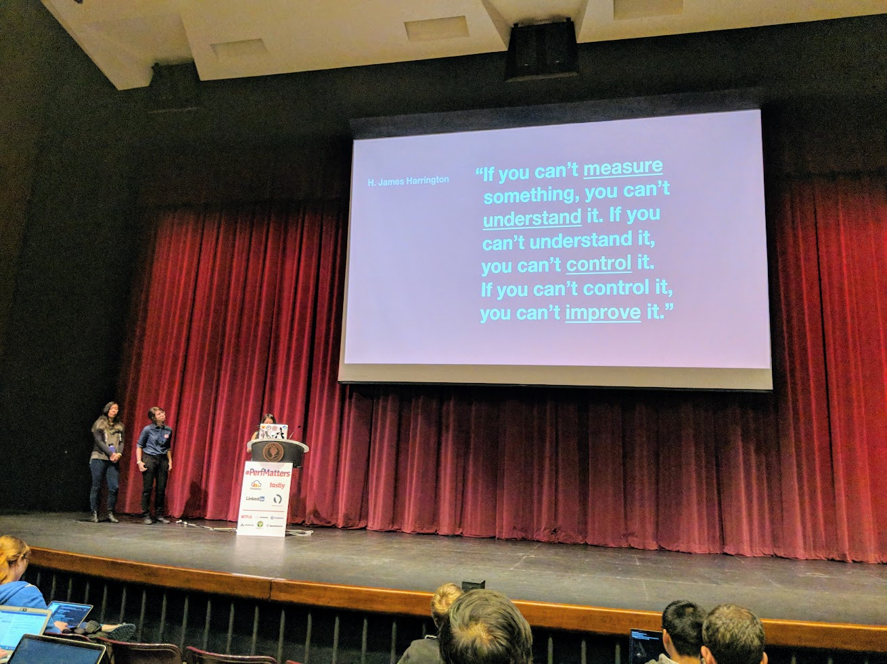
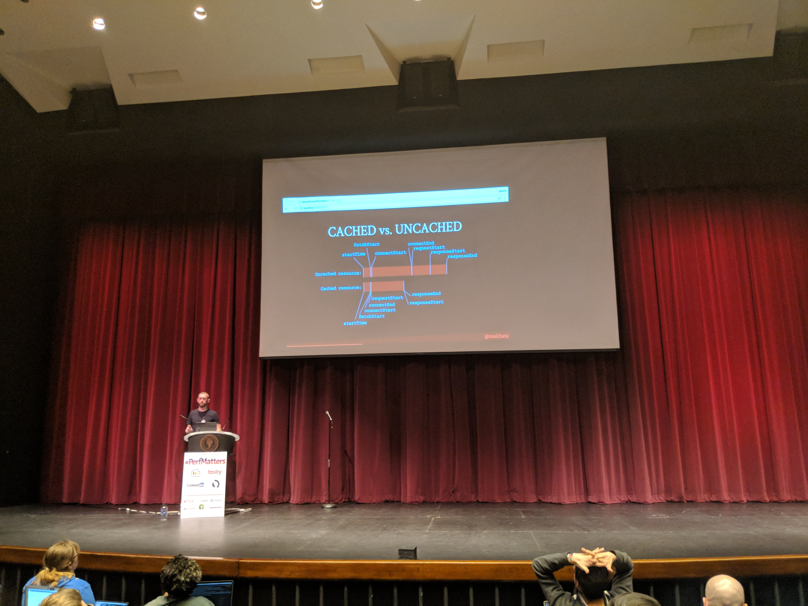
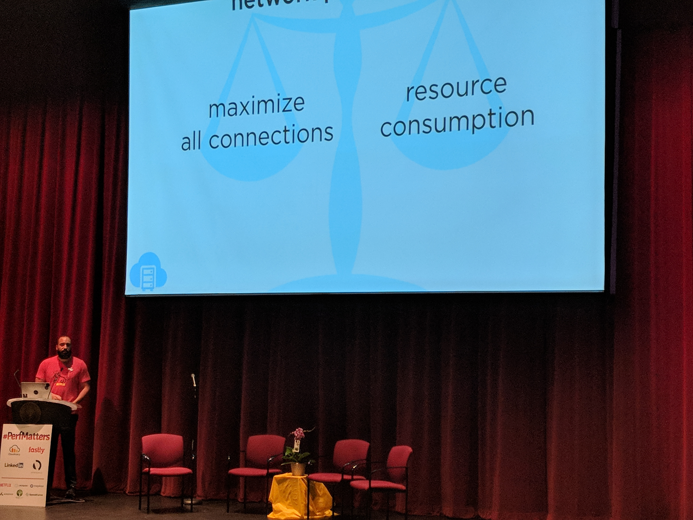
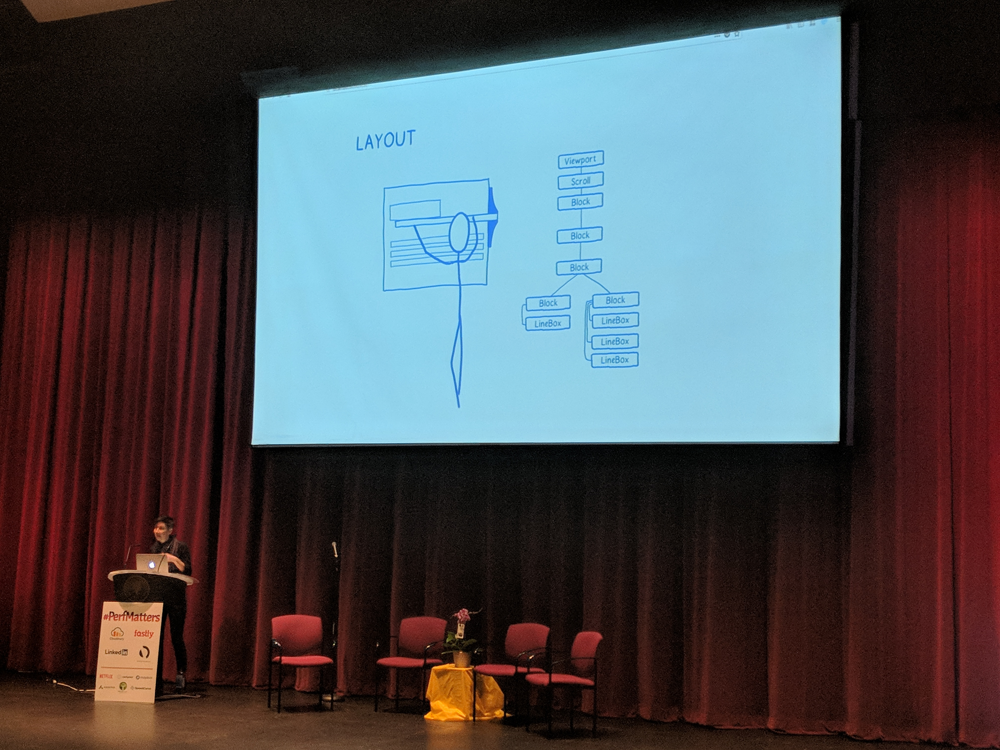
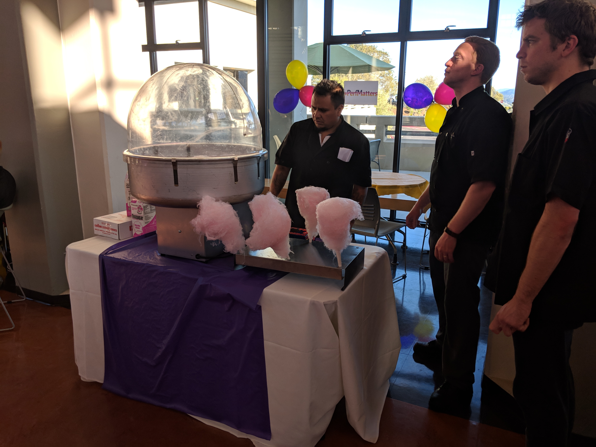
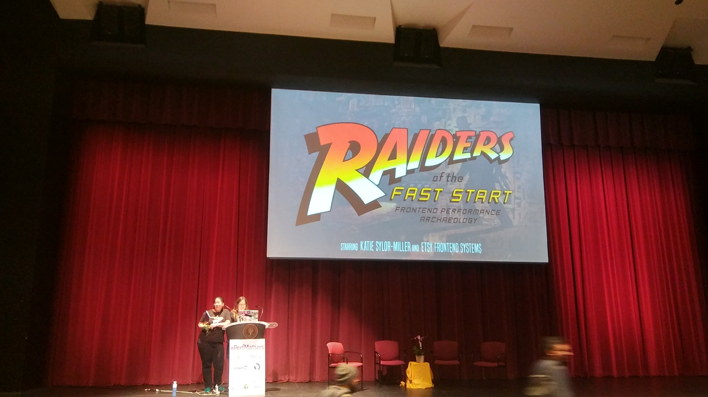
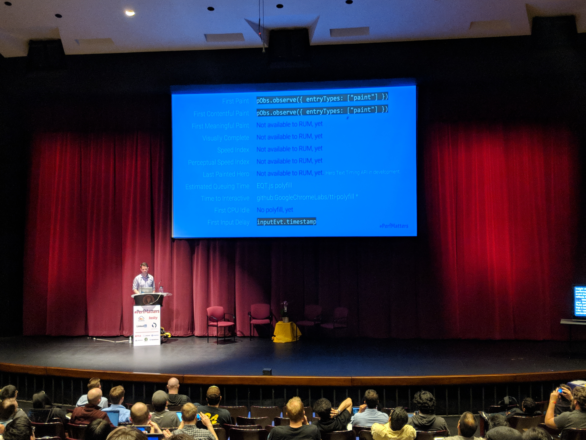

[#PerfMatters](https://perfmattersconf.com) is a camelCase hashtagged conference put on by web developer, O'Reilly author, and all around awesome person [Estelle Weyl](http://www.standardista.com/). The conference was held at the beautiful location of Cañada (pronounced Can-yada) College in Redwood City CA, which lies at the midway point between San Francisco and Silicon Valley.

I was super excited to go to #PerfMatters, although to be honest, I was also a little bit intimidated because all of the _cool_ silicon valley companies. However, when after I started talking to people I found out later that they're running into the same 💩 that everyone else is.

## But first...

I traveled out to Oakland the weekend beforehand, and got to hang out with coworker and friend [Nate](https://twitter.com/quicksketch). If you want to skip this part, feel free to <a href="#perfmatters">jump directly to the conference notes ↓</a>.

### Day one in California

On Saturday, we started off by hiking [Muir Woods](https://www.nps.gov/muwo). Muir Woods is a nature reserve with amazing groves of huge redwood trees nestled among scenic mountain streams. 

I think we ended up hiking 4-6 miles at Muir Woods, which left me wanting more. Mt Tam delivered. 

[Mount Tamalpais](https://en.wikipedia.org/wiki/Mount_Tamalpais) is the highest peak in the north bay area. Although you can drive up, we hiked up from Panoramic Highway. It was a pretty awesome hike. We passed through a couple different localized ecosystems including hardwoods, redwoods, scrubs, streams, and more. 

Finally, after what seemed like 10,000 near vertical steps, we were finally treated to beautiful panoramic views of the Pacific Ocean, the North Bay, and more.

### Day two adventures

On Sunday <strike>morning</strike> afternoon, Nate made me the _fucking bestest_ breakfast burrito that I've ever had. Seriously. It had avocados, apples, as well as normal breakfast burrito stuff like sausage and eggs. It was pretty fantastic to say the least. Anyway...

Later that day, we cruised around San Francisco bay in a sailboat. We had some cool views of Alcatraz and the Golden Gate bridge, and the beer was surprisingly cheap! Later that night I kicked both Nate and [Jen](https://twitter.com/jenlampton)'s asses at Settlers of Catan 😛

<figure border>
    
    <figcaption>No one can compete with how cool we are 😎</figcaption>
</figure>

### Down to Redwood City

On Monday, I visited SF (that's how all the _cooool_ locals refer to San Francisco) and then headed down to Redwood City, which is about 30 miles south.

Through the magic of the #Perfmatters Slack organization, I met up with [David Ross](https://twitter.com/cdaveross) Monday night on Monday night for some beer and pastrami sandwiches at [The Refuge](https://www.refugesc.com), which had been featured in _Diners, Drive-Ins and Dives_.

The best part of the night was learning from, who is probably, one of the most beer-knowledgeable people that I've ever met. I learned the difference between a "small IPA", and "session IPA", and more. He also got me to finally download [Untappd](https://untappd.com/)!

## The conference kicked off Tuesday morning. 

Although all sessions were absolutely amazing... I'm going to detail the sessions that I got a lot out of below.

I'm also going to include links to [Cristina Shaver](http://www.cristinashaver.com/)'s [awesome notes](https://github.com/cshaver/perfmatters-notes) from each session.

### Making Pinterest Fast
by 
  <a href="https://www.twitter.com/missyjcat">Jessica Chan</a>, 
  <a href="https://www.twitter.com/sarahddubs">Sarah Dapul-Weberman</a>, and 
  <a href="https://www.twitter.com/micvu">Michelle Vu</a>

<figure border>
    
    <figcaption>Jessica, Sarah, and Michelle presenting on putting together a performance team at Pinterest.</figcaption>
</figure>
The Pinterest performance team showed how they measure performance by tracking the most important parts of a page and assigning a computed metric that takes this into account. They showed off a really cool dashboard where they would constantly track the performance of the site (they track the 90th percentile). 

When they detect a regression, they have a tool that automatically does a git bisect and then run performance regression tests to find the exact culprit commit. The performance team will then work with the author to fix the performance regression.

Notes: 
<a href="https://github.com/cshaver/perfmatters-notes/blob/master/day-1/Making-Pinterest-Fast_Jess-Michelle-Sarah.md">Link to Cristina Shaver's notes</a>

### Faster Bytes is Not Always Enough - Why is The Web Slow? (and what can we do about it)
by 
<a href="https://twitter.com/yoavweiss">Yoav Weiss</a> from Akamai
<figure border>
    
    <figcaption>Yoav Weiss from Akamai presenting on various network protocols and making things faster.</figcaption>
</figure>

Yoav gave an excellent talk about various performance slowdowns on the web and how to fix it. He talked about TCP slow start, HTTP2 (aka h2), and QUIC. He detailed how h2 push works and how the browser discovers resources and in what order. He talked about new methods for optimizing this including `<link rel="preload">` and `<link rel="preconnect">`.

One of my next goals is to to better understand the preload, preconnect, et al tags, and write an article about this.

Notes: 
<a href="https://github.com/cshaver/perfmatters-notes/blob/master/day-1/Past-Present-and-Future-of-Resource-Loading_Yoav-Weiss.md">Link to Cristina's notes on this talk</a> 
Slides: <a href="https://yoavweiss.github.io/perfmatters_resource_loading/">Yoav's Slides</a>

### Demystifying Performance Timings
by <a href="https://twitter.com/malchata">Jeremy Wagner</a>
<figure border>
    
    <figcaption>Jeremy Wagner dropping knowledge on various performance tuning APIs.</figcaption>
</figure>

Jeremy Wagner gave a deep dive into [the navigation timing API](https://developer.mozilla.org/en-US/docs/Web/API/Navigation_timing_API). The session was packed with lots of deep information and recipes.

Notes: 
<a href="https://github.com/cshaver/perfmatters-notes/blob/master/day-1/Demystifying-Performance-Timers_Jeremy-Wagner.md">Link to Cristina's notes on this talk</a>

### Modern Performance in the Year of the Dog
by <a href="https://twitter.com/jemyoung">Jem Young from Netflix</a>
<figure border>
    
    <figcaption>Netflix's Jem Young presenting on dogs. He also talked a bit about frequently made trade-offs all developers have to make.</figcaption>
</figure>

Netflix Engineering's Jem Young gave session on "Modern Performance in the Year of the Dog." It was amazing because he talked about real world trade-offs that front-end developers and engineers make on a daily basis. Sometimes various objectives don't always align together properly, and Jem discussed this. 

I generally don't go for non-technical sessions such as this, but Jem totally nailed it.

Notes: 
<a href="https://github.com/cshaver/perfmatters-notes/blob/master/day-1/Modern-Performance-in-the-Year-of-the-Dog_Jem-Young.md">Link to Cristina's notes on this talk</a> 

### Making the browser faster
by <a href="https://twitter.com/linclark">Lin Clark</a> from Mozilla
<figure border>
    
    <figcaption>Mozilla's Lin Clark presented on concepts and efforts into making Firefox faster. She also creates these amazing illustrations.</figcaption>
</figure>

Lin Clark's official (maybe?) title at Mozilla is "code cartoonist" because she has an ability to convey complex topics [through _really cool_ illustrations and comics](https://code-cartoons.com). True to her form, Lin's session on making browsers faster was amazing. 

Mozilla has been working on parallelizing its architecture for years. In fact,they've actually created a brand new programming language ([Rust](https://www.rust-lang.org)) to facilitate this! 

The part that made me grin with excitement is when she said they were working to offload the entire painting process to the computer's GPU, which would make animating any property (such as background, or box-shadow) as performant as we can now do with animating CSS transforms and opacity.

### Tuesday night party
Sponsored by [SpeedCurve](https://speedcurve.com/)
<figure border>
    
    <figcaption>No shit &mdash; they had a cotton candy machine!</figcaption>
</figure>
Estelle had planned a really cool party that was right across the way from the theater. The party had a cotton candy machine, the best balloon maker I've ever seen, and best of all... an open bar sponsored by SpeedCurve

I had a great time at the party including hanging out with some old friends and getting the chance to meet [Lin Clark](https://twitter.com/linclark), [Steve Souders](https://twitter.com/Souders), [Marcy Sutton](https://twitter.com/marcysutton) (who I had [previously interviewed](https://www.lullabot.com/podcasts/drupalizeme-podcast/web-accessibility-with-marcy-sutton) on the Lullabot Podcast), in addition to many more awesome people. 

## Thursday Presentations

### Raiders of the Fast Start: Frontend Performance Archaeology
by <a href="https://twitter.com/ksylor">Katie Sylor-Miller</a> from Etsy
<figure border>
    
    <figcaption>Etsy's Katie Sylor-Miller presenting on removing old code. Photo by <a href="https://twitter.com/ZorphDark/status/979120180805554176">Alejandro Cuba Ruiz</a></figcaption>
</figure>

Katie Sylor-Miller from Etsy presented on Frontend Performance Archaeology. This session was great because she talked about how Etsy's codebase grew to become an unmanageable behemoth, and people were afraid to remove code, so would only add to it. She talked about various tools and techniques to fix this and reduce various bundle sizes.

### Perceived Performance: The only kind that really matters
by <a href="https://twitter.com/EliFitch">Eli Fitch</a> from MapBox
<figure border>
    
    <figcaption>xxx</figcaption>
</figure>

Eli Fitch from Mapbox presented on "Perceived Performance: The only kind that really matters". This was really good, and I plan on making Lullabot's designers watch this if the videos ever get posted. 

slides http://assets.eli.wtf/talks/perceived-perf-perfmatters-2018/#/

Basically Eli talked about various "mental" design techniques to trick your mind into making the website 'feel' like it's faster (even though it's not). Techniques included animations on progress bar, discussion of spinners vs progress bars. Using the mousedown even instead of the click event.

### Progressive Web Apps: Show Up for Offline First, but Stay for the Killer Performance Boost
by <a href="https://twitter.com/jlengstorf">Jason Lengstorf</a>

Another great session was Jason Lengstorf -currently working at Gatsby, presenting on "Progressive Web Apps: Show Up for Offline First, but Stay for the Killer Performance Boost"

Jason talked about making your app work offline, and technologies involved (manifest, service workers). He also talked about the PRPL pattern and why it's fast.

slides https://jlengstorf.github.io/presentations/pwa-perf

### Web Perf Metrics & Measurement in 2018
by <a href="https://twitter.com/paul_irish">Paul Irish</a> from Google
<figure border>
    
    <figcaption>Holy 💩, it's Paul Irish!</figcaption>
</figure>
The conference ended with the biggest draw (and one of my developer heros), Paul Irish, who is a xxx at Google -- working on Chromium and DevTools. 

Paul talked about a lot of performance metrics (and there are a lot), how they are calculated, and which ones to pay attention to and when.

slides https://docs.google.com/presentation/u/3/d/1UcjvtuMT4VAmc-MySWOcc1rLkMNoDjt2DxIhvfHNRXg/present

best picture https://twitter.com/estellevw/status/979231389080985601