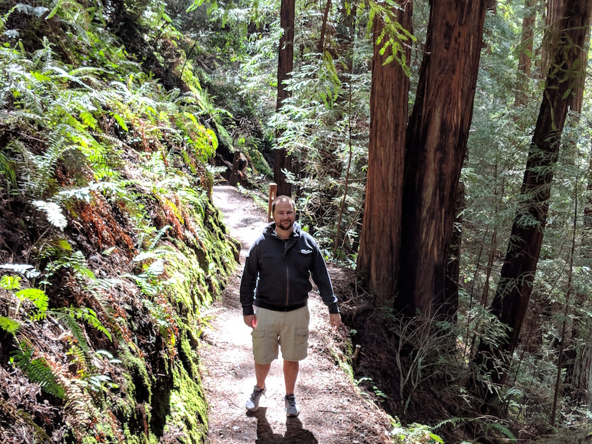
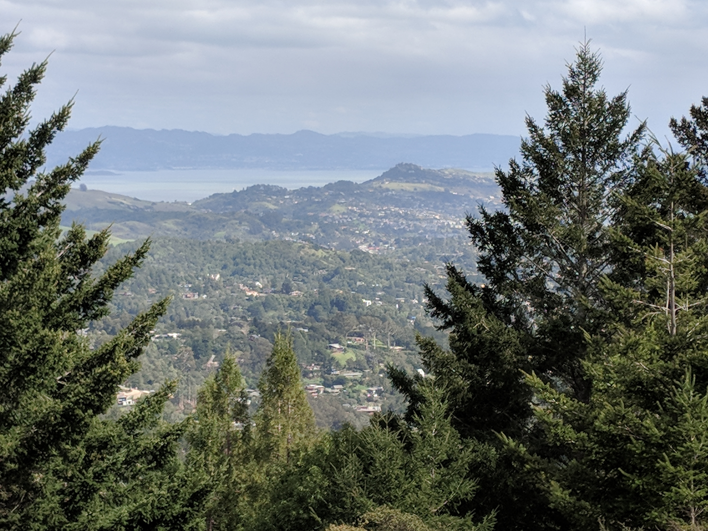
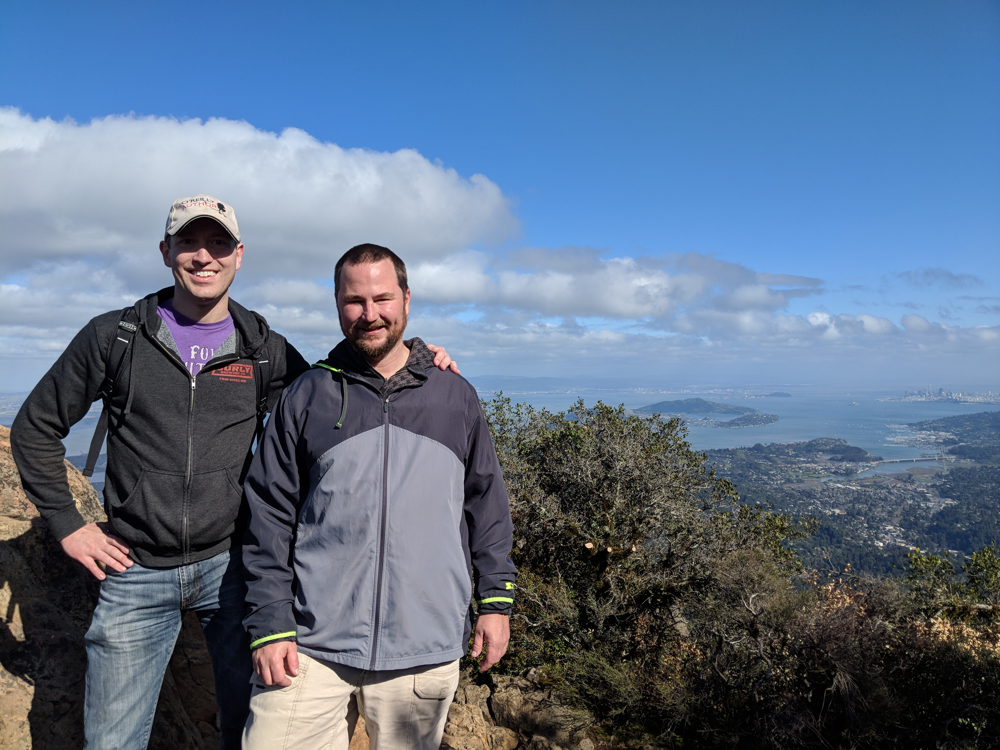
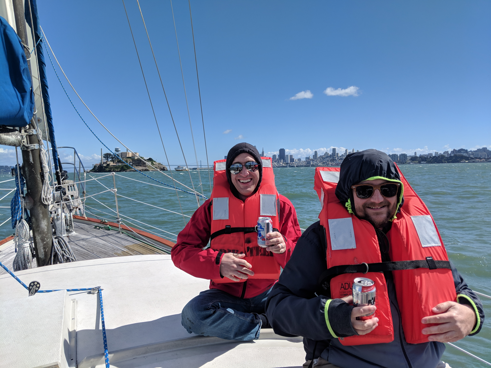

[#PerfMatters](https://perfmattersconf.com) is a small conference put on by web developer, O'Reilly author, and all around awesome person [Estelle Weyl](http://www.standardista.com/). The conference was held at the beautiful location of Cañada (pronounced Can-yada) College in Redwood City CA, which lies at the midway point between San Francisco and Silicon Valley.

I was super excited to go to Perfmatters, although to be honest, I was also a little bit intimidated because all of the _cool_ silicon valley companies. However, when after I started talking to people I found out later that they're running into the same 💩 that everyone else is.

## But first

I traveled out to Oakland the weekend beforehand, and got to hang out with coworker and friend [Nate](https://twitter.com/quicksketch).

### Day one in California

On Saturday, we started off by hiking Muir Woods. Muir Woods is a nature reserve with amazing groves of huge redwood trees nestled among scenic mountain streams. 

I think we ended up hiking 4-6 miles at Muir Woods, which left me wanting more. Mt Tam delivered. 

Mount Tamalpais is the highest peak in the north bay area. Although you can drive up, we hiked up from Panoramic Highway. It was a pretty awesome hike. We passed through a couple different localized ecosystems including hardwoods, redwoods, scrubs, streams, and more. 

Finally after what seemed like 10,000 near vertical steps up, we were finally treated to beautiful panoramic views of the Pacific Ocean, the North Bay, and more.

### Day two adventures

On Sunday, we cruised around the bay in a sailboat. We had some cool views of Alcatraz and the Golden Gate bridge, and the beer was surprisingly cheap! Later that night I kicked both Nate and [Jen](https://twitter.com/jenlampton)'s asses at Settlers of Catan 😛

<figure border>
    
    <figcaption>No one can compete with how cool we are 😎</figcaption>
</figure>

## Down to Redwood City

Monday I visited SF (that's how all the _cooool_ locals refer to San Francisco) and then headed down to Redwood City, which is about 30 miles south.

Through the magic of the #Perfmatters Slack organization, I met up with [David Ross](https://twitter.com/cdaveross) Monday night on Monday night for some beer and pastrami sandwiches at [The Refuge](https://www.refugesc.com), which had been featured in _Diners, Drive-Ins and Dives_.

The best part of the night was learning about beer from who is probably one of the most beer-knowledgeable people that I've met. I learned the difference between a "small IPA", and "session IPA", and more.

The conference kicked off Tuesday morning. 

Although all sessions were absolutely amazing... A couple notable sessions were

Pinterest - showed off a really cool dashboard where they would constantly track the performance of the site (they track the 90th percentile). 

If they detect a regression, they have a tool that automatically does a git bisect and then run performance regression tests to find the exact culprit. The performance team will then work with the author to fix the performance regression.

Yoav's session about HTTP2 aka h2 had a lot of great information including the http 1/1 handles poor connections better. Also talked about link preload prefetch etc.

slides https://yoavweiss.github.io/perfmatters_resource_loading/#1

Jeremy Wagner's session on performance timings were jam packed with lots of deep information on the navigation timing api and others.

Jem Young's session on "Modern Performance in the Year of the Dog" was amazing because he talked about real trade offs that front-end developers and engineers make on a daily basis. Sometimes various objectives don't always align together properly.

Lin Clark's session on faster was amazing. Lin works for Mozilla and talked about Firefox's effort to parallize its processing of the webpage. 

The part that made me grin with excitement is when she said they were working to offload the entire painting process to the computer's GPU, which would make animating any property (such as background, or box-shadow) as performant as we can now do with animating CSS transforms and opacity.

Tuesday night party

Estelle had planned a really cool party that was right across the way from the theater. The party had a cotton candy machine, the best balloon maker I've ever seen, and best of all... an open bar sponsored by SpeedCurve

I had a great time at the party including hanging out with Ian Caricou and getting the chance to meet Lin Clark, Marcy Sutton (who I had previous interviewed on the Lullabot Podcast) and Steve Souders. 

Wednesday's selected sessions

Katie Sylor-Miller from Etsy presented on Frontend Performance Archaeology. This session was great because she talked about how Etsy's codebase grew to become an unmanageable behemoth, and people were afraid to remove code, so would only add to it. She talked about various tools and techniques to fix this and reduce various bundle sizes.

Eli Fitch from Mapbox presented on "Perceived Performance: The only kind that really matters". This was really good, and I plan on making Lullabot's designers watch this if the videos ever get posted. 

slides http://assets.eli.wtf/talks/perceived-perf-perfmatters-2018/#/

Basically Eli talked about various "mental" design techniques to trick your mind into making the website 'feel' like it's faster (even though it's not). Techniques included animations on progress bar, discussion of spinners vs progress bars. Using the mousedown even instead of the click event. 

Another great session was Jason Lengstorf -currently working at Gatsby, presenting on "Progressive Web Apps: Show Up for Offline First, but Stay for the Killer Performance Boost"

Jason talked about making your app work offline, and technologies involved (manifest, service workers). He also talked about the PRPL pattern and why it's fast.

slides https://jlengstorf.github.io/presentations/pwa-perf

The conference ended with the biggest draw (and one of my developer heros), Paul Irish, who is a xxx at Google -- working on Chromium and DevTools. 

Paul talked about a lot of performance metrics (and there are a lot), how they are calculated, and which ones to pay attention to and when.

slides https://docs.google.com/presentation/u/3/d/1UcjvtuMT4VAmc-MySWOcc1rLkMNoDjt2DxIhvfHNRXg/present

