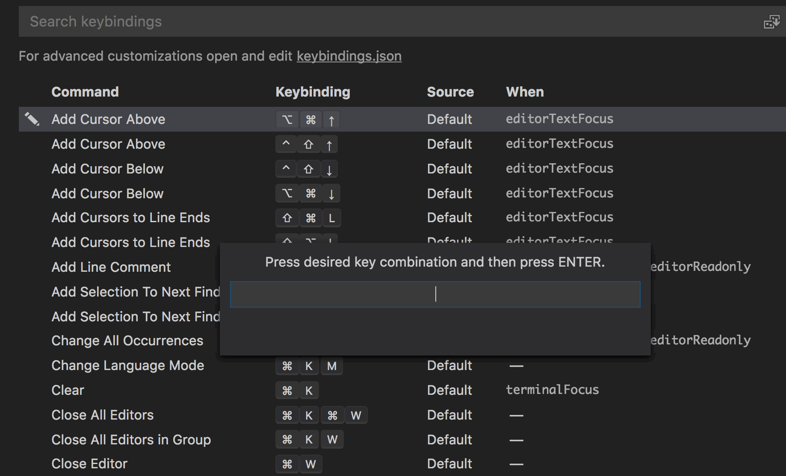

On every new project I try to change one or two tools and/or techniques. This is a good balance, because if I change too many things, I get bogged down in the details and functionality of new tools. But if I change nothing, I never get the chance to learn new tools, and increase my productivity.

For my personal blog (you're reading it), I'm switching my text-editor from Sublime Text to Visual Studio Code.

## Why the switch?


## My background
on Mac
Dreamweaver
Sublime
PHPStorm

## VSCode's plugin management is 👌

VSCode's plugin handling is great. It's easier than Sublime's plugin handling because of a number of reasons.

1. The plugin management interface is easy to find. The plugin dashboard has its own icon to the left of the directory tree.
2. It will recommend plugins to you based on the types of files that you open. If I open lots of markdown files, it will recommend a popular markdown plugin. If I open lots of JavaScript files, it will show me plugins for that.
3. It allows you to install plugins through the GUI. Normally, I like to use keyboard shortcuts for everything. But, installing plugins is not a normal day-to-day activity. Browsing, choosing, installing, and configuring plugins is easier through a graphical interface.
4. It shows your currently installed plugins, and allows you to disable/uninstall them easily. This makes it easy to test-drive and compare plugins.
5. You can easily search for new plugins using the GUI, or just show the most popular plugins for you to explore.

### Here's what I currently have installed

* [Beautify](https://github.com/HookyQR/VSCodeBeautify) reformats and reindents your JavaScript, CSS, HTML and more.
* [Drupal Syntax Highlighting](https://github.com/mastazi/VS-code-drupal) does exactly what you think it does :)
* [ESLint](https://github.com/Microsoft/vscode-eslint) provides integration with the popular ESLint JavaScript linting engine. This highlights syntax errors and code formatting issues in your JavaScript.
* [Markdown All in One](https://github.com/neilsustc/vscode-markdown) provides additional functionality for markdown including `CMD` + `B` to bold your text, and `CMD` + `I` to italicize.
* [Spell Right](https://github.com/bartosz-antosik/vscode-spellright) is a spellchecker for VSCode.
* [Sublime Text Keymap](https://github.com/Microsoft/vscode-sublime-keybindings) adds additional keymaps similar to Sublime Text for VSCode. 
* [VSCode Icons](https://github.com/vscode-icons/vscode-icons) gives you a different icon for each type of file within your file explorer. This makes it much easier to find the file you're looking for.
* [VSCode-styled-components](https://github.com/styled-components/vscode-styled-components) allows for CSS highlighting, indentation, and autocomplete when you're using CSS in JS solutions like [Emotion](https://github.com/emotion-js/emotion).

## Common Keyboard shortcuts

Avoiding using your mouse or trackpad is vital to coding quickly. To that end, here are some keyboard shortcuts that I use often.

* `CMD` + `P` Brings up a prompt where you can type in the name of a file, hit enter, and have the file opened.
* `CMD` + `Shift` + `P` Brings up Command Palette. I frequently use "Change Language Mode".
* `Opt` + `↑ or ↓` Move selected text block. 
* `CTRL` + `CMD` + `G` Select all occurrences of highlighted string
* `CMD` + `D` Select next occurrence of highlighted string

VS Code allows you to easily edit your personal keyboard shortcuts pretty easily under the **Preferences** menu.



## Git Diffs

## Git Merges

## Tips

## How is the speed?

### Open the current directory in VSCode from the terminal

You can open the current directory from the command line by typing 
```bash
$ code .
```
Note [You have to do a small bit of setup](https://code.visualstudio.com/docs/setup/mac) to get this to work.