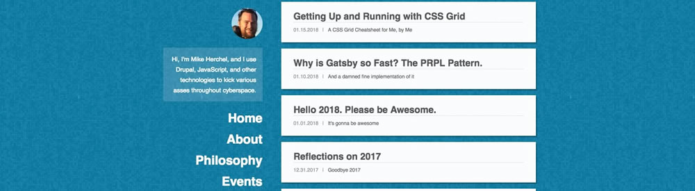

I added an [easter egg](https://en.wikipedia.org/wiki/Easter_egg_(media)) to my blog last week. If you click and drag the background (you have to be on a screen wider than 1200px to do so), the page's primary color will change. It's pretty silly, but I had a lot of fun doing it and *I think* it looks pretty sweet. 


Here's a [video of the color changing in action](./color-changing-variables.mp4), just in case you're on mobile.

Anywho... here's how it's done and why it's performant.

## First, let's set up the fixed background

Before we can start messing with CSS variables or React, let's get the background setup.

My default background color is `deepskyblue`. 

```css
body {
  background-color: deepskyblue;
}
```

For the background image, I'm using a pattern from [Subtle Patterns](https://www.toptal.com/designers/subtlepatterns/) that can be downloaded [here](https://www.toptal.com/designers/subtlepatterns/subtle-grey/). 

I want the background image to be fixed (meaning that it won't move when scrolled). But, that introduces a performance issue: When scrolling on a page that has `background-attachment: fixed;`, the browser will continuously [repaint](https://developers.google.com/web/fundamentals/performance/rendering/simplify-paint-complexity-and-reduce-paint-areas) while you're scrolling. This is expensive for the CPU, and can often lead to situations where the page acts "janky" while scrolling. 

To work around this, I'm creating a `::before` pseudo-element on the `body`, and then fixed positioning it, *and* promoting it to its own [composite layer](https://www.html5rocks.com/en/tutorials/speed/layers/) using `backface-visibility: hidden;`. This will mitigate any scrolling issues.

```css
body:before {
  content: "";
  position: fixed; /* This will not scroll with the page. */
  z-index: -1; /* Make sure it appears behind any content. */
  left: 0;
  top: 0;
  width: 100%;
  height: 100vh;
  backface-visibility: hidden; /* This is what promotes it to its own layer. */
  background-image: url(/bg.jpg);
}
```

Now the background image is taking up the full width of the screen and doesn't scroll &mdash; but, it doesn't look right yet. We cannot see the color underneath.


To fix this, we need to grayscale the image, invert the colors, and then add an opacity. We do all of this via CSS:

```css
body:before {
  content: "";
  position: fixed;
  z-index: -1;
  left: 0;
  top: 0;
  width: 100%;
  height: 100vh;
  backface-visibility: hidden;
  background-image: url(/bg.jpg);

  /* New stuff down here. */
  opacity: 0.4;
  filter: grayscale(100%) invert(100%);
}
```

Here's what it looks like now.



Looking good! But, we still need to add that sweet fade that's near the top. To do this, we're using a [linear-gradient](https://developer.mozilla.org/en-US/docs/Web/CSS/linear-gradient) fading between `deepskyblue` and `transparent`. 

Because we also do not want this to scroll, we're using the `::after` pseudo element on the `body` tag in a similar fashion to what we did before.

```css
body:after {
  content: "";
  position: fixed;
  z-index: -1;
  backface-visibility: hidden;
  top: 0;
  left: 0;
  width: 100%;
  height: 100vh;
  background-image: linear-gradient(to bottom, deepskyblue, transparent 70%);
}
```

Now it looks right! But, there's a problem. We're declaring `deepskyblue` twice. What can we do about that?

## CSS Variables to the rescue!

[CSS Variables](https://developer.mozilla.org/en-US/docs/Web/CSS/Using_CSS_variables) (aka CSS Custom Properties) are awesome. Let's get started. 

First we'll add the variable to the `:root` element (which is the `<html>` element). We call this `--primary` because it's the primary color. Variables are always prepended with double-hyphens.

```css
:root {
  --primary: deepskyblue;
}
```

Then we can change around the background color, and the linear-gradient using the `var()` function.

```css
body {
  background-color: var(--primary);
}

body:after {
  background-image: linear-gradient(to bottom, var(--primary), transparent 70%);
}
```

While we're at it, let's change the colors of hyperlinks and `h3` tags.

```css
.content a {
  color: var(--primary);
}

h3 {
  color: var(--primary);
  filter: brightness(75%); /* Let's darken this a bit. */
}
```

Looking good, but how can we manipulate the colors?

## Convert the colors to HSLA

We're going to use HSLA colors here. HSLA stands for **H**ue, **S**aturation, **L**ightness, and **A**lpha. This means that we can change the any of these values individually.

We can use an [online color converter](https://www.w3schools.com/colors/colors_converter.asp) to convert from `deepskyblue` to HSLA.

```css
body {
  background-color: hsl(195, 100%, 50%, 1); /* This is the same as deepskyblue. */
}
```
Because we're planning on manipulating the hue and lightness separately, let's split each value into their own CSS variable and *then* combine all of those into the `--primary` variable.

```css
:root {
  --primary: hsla(var(--primary-hue), 
                  var(--primary-saturation), 
                  var(--primary-lightness), 
                  var(--primary-alpha));
  --primary-hue: 195;
  --primary-saturation: 100%;
  --primary-lightness: 50%;
  --primary-alpha: 1;
}
```
*Now we're cooking with gas... err... variables!*

Pretty neat! But, we still need to change these variables into React.

## Bringing in ReactJS

Updating the variables would be pretty easy to do with vanilla JavaScript, but since this blog is using [ReactJS](https://reactjs.org/), we're going to make use of that.

The first thing we need to do is keep track of current *hue* and *lightness* via React's state system. 

### Set up state

```js
class Template extends React.Component {
  constructor() {
    super()
    this.state = {
      hue: 195,
      lightness: 50
    }
  }
  render() {
    ...
  }
}
```

### Track mouse movement

Next, we track the mouse movement via the `mousemove` event listener, and we calculate and then update the hue and lightness based on the mouse's X and Y position.

```js
class Template extends React.Component {
  constructor() {
    super()
    this.handleMouseMove = this.handleMouseMove.bind(this)
    this.state = {
      hue: 195,
      lightness: 50
    }
  }
  handleMouseMove(e) {
    const hueIncrement = window.innerHeight / 360
    const mouseYPositionPercent = (e.clientY / window.innerHeight) * 100
    const hue = mouseYPositionPercent * hueIncrement
    const lightness = (e.clientX / window.innerWidth) * 100

    this.setState({ hue, lightness })
  }
  render() {
    // ...
  }
}
```

We pass the event object into this method. `e.clientX` and `e.clientY` will return the mouse's position within the viewport.

### Set up event listeners

The `mousemove` event won't fire unless we set up an event listener to tell it to do so. For performance reasons, we only want this to be active when the mouse button is actively being pressed.

So, we need to set up methods to handle both the `mousedown` and `mouseup` events.

```js
class Template extends React.Component {
  constructor() {
    super()
    this.handleMouseDown = this.handleMouseDown.bind(this)
    this.handleMouseUp = this.handleMouseUp.bind(this)
    this.handleMouseMove = this.handleMouseMove.bind(this)
    this.state = {
      mousedown: false,
      hue: 195,
      lightness: 50
    }
  }
  // ...
  handleMouseDown(e) {
    if (!e.target.matches(`.${layoutStyles}, .${layoutStyles} *`)) {
      this.setState({ mousedown: true })
      document.addEventListener('mousemove', this.handleMouseMove)
    }
  }
  handleMouseUp(e) {
    this.setState({ mousedown: false })
    document.removeEventListener('mousemove', this.handleMouseMove)
  }
  render() {
    // ...
  }
}
```

We again pass the event object to the `handleMouseDown` method. We then check to see if the target of the click (`e.target`) is within the content area of the page. This is what verifies that the user initially clicked on the background before they started dragging their mouse. 

We use the [element.matches() API](https://developer.mozilla.org/en-US/docs/Web/API/Element/matches), which takes a standard selector (similar to what `document.querySelectorAll()` does). This blog uses [Emotion JS](https://github.com/emotion-js/emotion) to handle styling. So we have to pass in Emotion's `layoutStyles` variable. A couple of notes here:

* We're adding a dot `.` to the beginning of the `layoutStyles` variable because this is a class name selector.
* We also check to see if the click target is any element *within* `layoutStyles` by using a `*` descendent selector.

If those selectors *do not* match, we change the mousedown state and add an event listener for `mousemove`.

We also have a method for handling the `mouseup` event, that changes state and removes the event listener (for performance reasons) when the user stops pressing the mouse.

### Set up event listeners for mouseup and mousedown

We still need event listeners for the `mouseup` and `mousedown` events. To set these up, we place them within React's [componentDidMount()](https://reactjs.org/docs/react-component.html#componentdidmount) lifecycle method, which is invoked immediately after a component is mounted. 

```js
class Template extends React.Component {
  constructor() {
    super()
    this.handleMouseDown = this.handleMouseDown.bind(this)
    this.handleMouseUp = this.handleMouseUp.bind(this)
    // ...
  }
  // ..
  componentDidMount() {
    document.addEventListener('mousedown', this.handleMouseDown)
    document.addEventListener('mouseup', this.handleMouseUp)
  }
  componentWillUnmount() {
    document.removeEventListener('mousedown', this.handleMouseDown)
    document.removeEventListener('mouseup', this.handleMouseUp)
  }
  render() {
    // ...
  }
}
```

Note that we're also removing the event listeners when the component will unmount. This is best practice.

So at this point, we're updating React's state whenever the user drags their mouse starting at the background of the page. But how are we going to update the CSS variables with this information?

## Updating CSS Variables with React

The next goal is to insert a `<style>` tag to the bottom of my page's `<head>` tag. Within this, I can place new CSS to override the original CSS. 

To place the `<style>` within the `<head>`, I'm using the [React Helmet](https://github.com/nfl/react-helmet) library (which was developed by the [NFL](https://github.com/nfl) &mdash; cool!).

> This reusable React component will manage all of your changes to the document head. Helmet takes plain HTML tags and outputs plain HTML tags.

Let's get started.

```js
class Template extends React.Component {
  // ...
  render() {
    return (
      <div className={layoutStyles}>
        <Helmet>
          <style>{`
            :root {
              --primary-hue: ${this.state.hue};
              --primary-lightness: ${this.state.lightness}%;
            `}
          </style>
        </Helmet>
        // ...
      </div>
    )
  }
}
```
This is easy! Now when we drag the mouse, the CSS variables will get overridden.

We have one issue though. When dragging the mouse across the screen, it highlights all of the text. To handle this, we're going to temporarily enable the [user-select](https://developer.mozilla.org/en-US/docs/Web/CSS/user-select) CSS property, which can disable the ability to select text. We're going to bind this to the mousedown state.

```js
class Template extends React.Component {
  // ...
  render() {
    const { location, children } = this.props
    return (
      <div className={layoutStyles}>
        <Helmet>
          <style>{`
            :root {
              --primary-hue: ${this.state.hue};
              --primary-lightness: ${this.state.lightness}%;
              -webkit-user-select: ${this.state.mousedown ? 'none' : 'auto'};
              -moz-user-select: ${this.state.mousedown ? 'none' : 'auto'};
              user-select: ${this.state.mousedown ? 'none' : 'auto'};
            `}
          </style>
        </Helmet>
        // ...
      </div>
    )
  }
}
```
Note that we have to use prefixed versions of the property for Safari and Firefox.

## Conclusion

Hopefully you've learned a little about CSS Variables and React. CSS Variables are [supported in all the major browser versions](https://caniuse.com/#search=css%20variables), but are not supported in Internet Explorer 11 (which is depreciated by Edge).