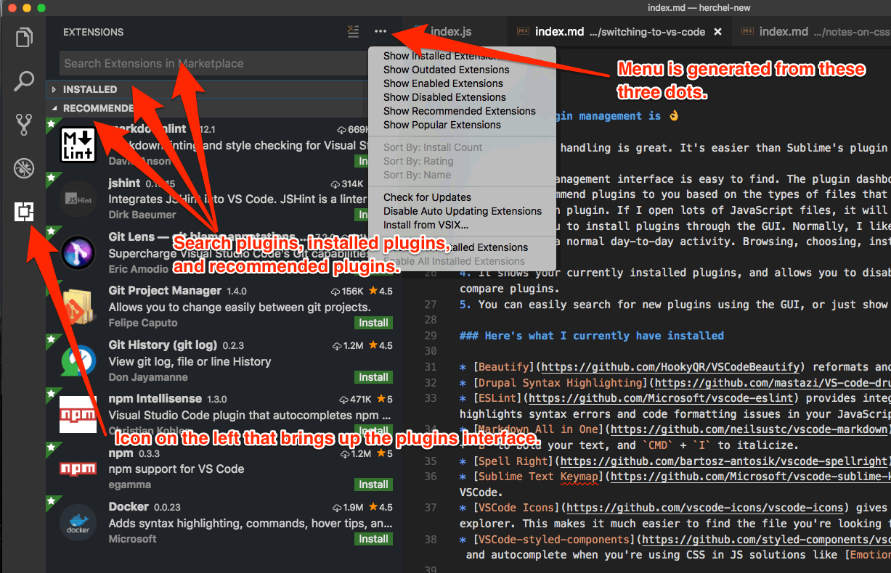

On every new project I try to change one or two tools and/or techniques. This is a good balance, because if I change too many things, I get bogged down in the details and functionality of new tools. But if I change nothing, I never get the chance to learn new tools, and increase my productivity.

For my personal blog (you're reading it), I'm switching my text-editor from Sublime Text to [Visual Studio Code](https://code.visualstudio.com/).

## Why the switch?

I've been using Sublime for over 5 years (wow &mdash; time goes fast). I've been hearing from some coworkers and friends that Visual Studio Code has really great JavaScript highlighting and is just *nice*.

<blockquote class="twitter-tweet" data-lang="en"><p lang="en" dir="ltr">What text editor are you using for programming these days?</p>&mdash; Smashing Magazine (@smashingmag) <a href="https://twitter.com/smashingmag/status/951924123357376512?ref_src=twsrc%5Etfw">January 12, 2018</a></blockquote>

I saw the tweet above as I was writing this article, which further solidifies the experiment.

## My background and perspective

I've been developing for the web since 2001, and I started out using Macromedia Dreamweaver and stuck with that through the end of the decade (using the code-only view for the majority of this time).

<figure>
    
    <figcaption>Yes I do still have Dreamweaver installed &mdash; I use it to edit email markup :)</figcaption>
</figure>

In 2012, I switched to Sublime Text 2, which was amazing. It was fast, lightweight, and clean. I installed various plugins including Emmet, ESLint, Sass, and more. I especially liked the multiple cursors functionality. 

<figure>
    
    <figcaption>Screenshot of Sublime Text.</figcaption>
</figure>

I also started using PHPStorm, not just for PHP, but for jQuery. I liked the built in intellisense (autocomplete, quick info, list parameters, etc) that was offered in PHPStorm, but not in Sublime.

<figure>
    
    <figcaption>Screenshot of PHPStorm showing some fancy jQuery that I authored.</figcaption>
</figure>

### What I didn't like about Sublime

Sublime is fast, but it's bare-bones. In order to get to a nice configuration, you need to install and configure many plugins such as [Package Control](https://packagecontrol.io/packages/Package%20Control), [Emmet](https://packagecontrol.io/packages/Emmet), [Sidebar Enhancements](https://packagecontrol.io/packages/SideBarEnhancements), [Sublime Linter](https://packagecontrol.io/packages/SublimeLinter), [Bracket Highlighter](https://packagecontrol.io/packages/BracketHighlighter), etc.

Sublime requires a lot of configuration, it has questionable code highlighting, and linting integration not super tight (even with Sublime Linter).

### What I didn't like about PHPStorm

PHPStorm seemed slow. It's slow to open &mdash; and although it's very feature packed, it's frequently hard to find what you're looking to do.

## About VSCode

Visual Studio Code is *weird*. It's created by Microsoft, which gives it away for free. In addition to Windows, they also support OSX and Linux. Weird. 

It's built on top of [Electron](https://electronjs.org/), which allows for the development of desktop apps using Chromium and Node, which are web development framework / runtimes.

VSCode occupies the sweet spot between IDE and text editor. It's fairly quick to launch &mdash; although not as quick as Sublime Text. But, that's not a huge deal. I have my editor open all day, as opposed to continually closing and relaunching. While the editor is open, it seems just as fast 😎.


## VSCode Features

VSCode comes with many features standard and enabled out of the box!

### Better usability than other editors

VSCode takes into account the little things that happen when editing. 

One of my favorite examples is that when you start dragging to collapse the sidebar, it will completely disappear when it gets under a minimum width &mdash; because this is what you're intending to do! 

When you want to expand the sidebar back, you can either drag it, *or* you can click on the *files* icon within the left menu bar. This makes it dead-easy for newcomers to figure out the operation.

VSCode also has much of the functionality of Sublime's popular plugins integrated. This makes it quicker to get up and running, and requires no configuration. VSCode includes functionality similar to [Package Control](https://packagecontrol.io/packages/Package%20Control), [Emmet](https://packagecontrol.io/packages/Emmet), [Sidebar Enhancements](https://packagecontrol.io/packages/SideBarEnhancements), [Bracket Highlighter](https://packagecontrol.io/packages/BracketHighlighter), and more. This makes *a lot* of sense, because the vast majority of users are going to make use of these at a given point.

More things worth mentioning:

* When deleting from my directory tree, VS Code will send the file to my trash as opposed to just deleting it.
* You can drag and drop files to move them around your directory tree.
* Easy to use git tools (more on this later).
* Easy to use find and replace functionality.

### Intellisense / Autocomplete

Intellisense includes autocomplete, quick info, list parameters, and more. And, it's enabled out of the box. If you're using JavaScript, it seems to work great &mdash; on par with PHPStorm and better than Sublime. 

<figure border>
    <video width="100%" autoplay controls loop muted>
      <source src="./intellisense.mp4" type="video/mp4">
    </video>
    <figcaption>Automatic completion in VSCode</figcaption>
</figure>

### VSCode's plugin management is top notch

VSCode's plugin handling is great. It's easier than Sublime's plugin handling, which is all text command based.

1. The plugin management interface is easy to find. The plugin dashboard has its own icon to the left of the directory tree.
2. It will recommend plugins to you based on the types of files that you open. If I open lots of markdown files, it will recommend a popular markdown plugin. If I open lots of JavaScript files, it will show me plugins for that.
3. It allows you to install plugins through the GUI. Normally, I like to use keyboard shortcuts for everything. But, installing plugins is not a normal day-to-day activity. Browsing, choosing, installing, and configuring plugins is easier through a graphical interface.
4. It shows your currently installed plugins, and allows you to disable/uninstall them easily. This makes it easy to test-drive and compare plugins.
5. You can easily search for new plugins using the GUI, or just show the most popular plugins for you to explore.


### Here are the plugins that I currently have installed

* [Beautify](https://github.com/HookyQR/VSCodeBeautify) reformats and reindents your JavaScript, CSS, HTML and more.
* [Drupal Syntax Highlighting](https://github.com/mastazi/VS-code-drupal) does exactly what you think it does :)
* [ESLint](https://github.com/Microsoft/vscode-eslint) provides integration with the popular ESLint JavaScript linting engine. This highlights syntax errors and code formatting issues in your JavaScript.
* [Markdown All in One](https://github.com/neilsustc/vscode-markdown) provides additional functionality for markdown including `CMD` + `B` to bold your text, and `CMD` + `I` to italicize.
* [Spell Right](https://github.com/bartosz-antosik/vscode-spellright) is a spellchecker for VSCode.
* [Sublime Text Keymap](https://github.com/Microsoft/vscode-sublime-keybindings) adds additional keymaps similar to Sublime Text for VSCode. 
* [VSCode Icons](https://github.com/vscode-icons/vscode-icons) gives you a different icon for each type of file within your file explorer. This makes it much easier to find the file you're looking for.
* [VSCode-styled-components](https://github.com/styled-components/vscode-styled-components) allows for CSS highlighting, indentation, and autocomplete when you're using CSS in JS solutions like [Emotion](https://github.com/emotion-js/emotion).

## Common Keyboard shortcuts

Avoiding using your mouse or trackpad is vital to coding quickly. To that end, here are some keyboard shortcuts that I use often.

* `CMD` + `P` Brings up a prompt where you can type in the name of a file, hit enter, and have the file opened.
* `CMD` + `Shift` + `P` Brings up Command Palette. I frequently use "Change Language Mode".
* `Opt` + `↑ or ↓` Move selected text block. 
* `CTRL` + `CMD` + `G` Select all occurrences of highlighted string
* `CMD` + `D` Select next occurrence of highlighted string
* `CTRL` + `~` Open up the integrated console. I don't use this daily, but it can be useful if I do not have my multiple monitors.

VS Code allows you to easily edit your personal keyboard shortcuts pretty easily under the **Preferences** menu.


## It's the little things


## Git Diffs

## Git Merges

## Tips

## How is the speed?

### Open the current directory in VSCode from the terminal

You can open the current directory from the command line by typing 
```bash
$ code .
```
Note [You have to do a small bit of setup](https://code.visualstudio.com/docs/setup/mac) to get this to work.