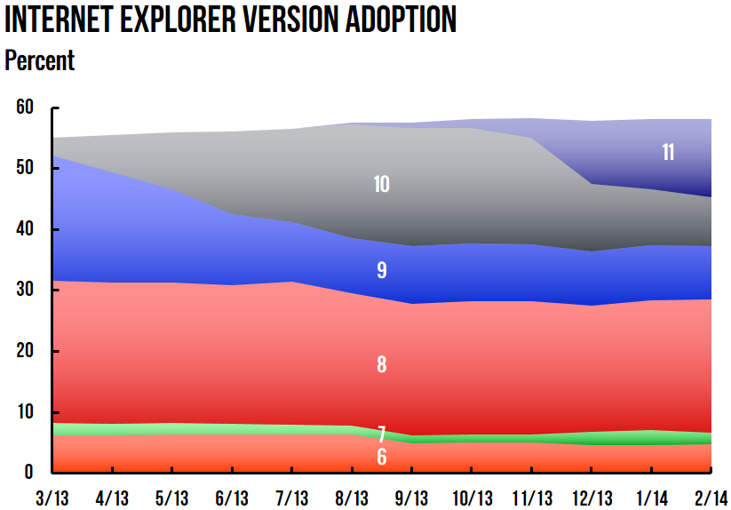

At the time of this writing, somewhere around 13% of the world’s web traffic is from Internet Explorer 8 (IE8). This can be even worse in certain demographics. Windows XP (and therefore IE8) is dying a slow death. It’s now unsupported by Microsoft (or not), but will probably be around for years to come.



Most front end developers don’t touch IE8 till the very end. The workflow looks something like the following: 1) develop in Chrome because it’s dev tools freakin rock 2) occasionally test in Safari, Firefox 3) at the very end test in Internet Explorer 4) facepalm.

At this point, most developers are turning red with rage and wishing a terrible death to Microsoft in the most cruel and inhuman manner. They’ll go to their PM and beg, “No one uses IE8- We don’t need it.”

But, what if I told you there was a better way?

## Step one: Test early. Test often.

Get out of the habit of waiting until the end to test. Testing needs to come early in the process. Often, you can easily make strategic decisions early in the process based on your testing:

* float, inline-block, or absolute positioning
* changing grid systems
* z-index issues
* javascript issues

Finding these issues early in the process allows you to change around your layout code early, eg. switching from inline-block elements to floats. Doing something like this is usually pretty simple early in the project, but can be a total pain in the ass toward the end.

### So, how do you test?

I personally use Remote Desktop to remote into a Windows XP machine that I have access to. This is the easiest situation for me. But, another great alternative is to use virtual machines (like [Parallels](http://www.parallels.com/products/desktop/) or [VirtualBox](https://www.virtualbox.org/)) to run Windows XP. You can download free (and legal) images from Microsoft’s [Modern.ie](http://modern.ie/en-us/virtualization-tools) website. Thanks Microsoft!

The key here is that you need to make testing easy. If it’s easy, it can be integrated into your workflow. I’ve tried services such as [BrowserStack](http://www.browserstack.com/), and for me they don’t work well enough. I need the browser to be responsive so I can test hover-states and get a general ‘feel’ for the webpage.

## Step two: IE Conditional Statements.

In a time not-to-long ago, many developers would put ugly CSS hacks into their stylesheets.

```css
/* IE6 */
* html #selector  { color: green; }
#selector { _color: green; }

/* IE6-7 */
#selector { color: green; }
#selector { color: green !ie; }

/* IE7 */
*:first-child+html #selector { color: green; }
*+html #selector { color: green; }

/* IE7-8 */
#selector { color/*\**/: green\9; }
```

The problem with this is 1) it makes your CSS invalid (who cares, right?), 2) because it’s invalid, it doesn’t always work with Sass and 3) its tough to maintain.

The obvious solution here is to use IE conditional statements.

```html
<!--[if lte IE 8]>
  <link type="text/css" rel="stylesheet" href="/css/ie-lte-8.css" media="all" />
<![endif]-->
```

I use this method to perform general ‘cleanup’ of the webpage. Adjust a margin here, padding over there. Maybe narrow the width on this div by 2px… And, definitely fix any RGBA transparency issues that IE8 doesn't understand (you can use semi-transparent PNGs for this).

## Step three: Dealing with Media Queries.

We’re all designing and developing our websites mobile-first, right? Right. With responsive website design (RWD), the styles nested under @media aren’t parsed by IE8. This means that all mobile-first RWD sites will look like the mobile version… which will probably be confusing as hell to the non-technical person driving that old Compaq PC.

In years past, front-end devs dealt with this by splitting up stylesheets by media query, and dedicating one 'full' stylesheet to IE8.

```html
<style type="text/css" media="all">
@import url("/css/global.css");
</style>
<style type="text/css" media="all and (min-width: 740px) and (min-device-width: 740px), (max-device-width: 800px) and (min-width: 740px)">
@import url("/css/default.css");
@import url("/css/default-narrow.css");
</style>
```

This is the wrong approach for a number of reasons:

1. You end up writing code more than once. Good developers try to use DRY (don’t repeat yourself) principles as much as possible.
1. You limit yourself to that specific number of breakpoints (typically 3 or so)
1. Multiple HTTP requests to download the stylesheet, in addition to the browser’s effort to parse multiple CSS files leads to performance issues

After that fad came to pass, many developers started using polyfils such as [respond.js](https://github.com/scottjehl/Respond) to work with IE8 to parse media queries. This works, but can lead to a [FOUC](http://en.wikipedia.org/wiki/Flash_of_unstyled_content) (flash of unstyled content) in your user’s malware-riddled circa 2001 Compaq PC.

### The best scenario

The best way to deal with IE8 would be to somehow magically rewrite all of your nested media query selectors into a ‘new’ stylesheet that could be pulled in to IE8 via conditional statements.

## Enter Breakpoint

[Breakpoint Sass](http://breakpoint-sass.com/) is magical. In addition to enabling a super-streamlined mobile-first workflow, it has options to rewrite all of your media query selectors into a different stylesheet!

To do this using Breakpoint, first write your sass or scss like normal.

```scss
/* _layout.scss */

#selector {
  background: blue;
  @include breakpoint($tablet_wide) {
    background: green;
  }
}
```

Be sure you have defined the breakpoint definitions...

```scss
/* _breakpoints.scss */

@import "breakpoint"; // Required to use the gem
$tablet_wide: 768px, 'no-query' '.no-mq';
```

This is the no-mq.scss fallback file that will generate the media query fallback file...

```scss
/* no-mq.scss */

$breakpoint-no-queries: true;
$breakpoint-no-query-fallbacks: true;

@import 'breakpoints';
@import 'layout';
```

This is the regular styles.scss for all browsers...

```scss
/* styles.scss */

$breakpoint-no-queries: false;
$breakpoint-no-query-fallbacks: false;

@import 'breakpoints';
@import 'layout';
```

This is the styles.css that gets generated and sent to all browsers...

```css
/* styles.css */

#selector {
  background: blue;
}
@media (min-width: 768px) {
  #selector {
    background: green;
  }
}
```

And, this is the magical no-mq.css to be included in the conditional statement!!! Woohoo!

```css
/* no-mq.css */

#selector {
  background: blue;
}
.no-mq #selector {
  background: green;
}
```

So, you're probably thinking, "What's up with the .no-mq selector?"

Many people will use conditional IE statements to wrap around their HTML tags. Another option is to use something like [Modernizr](http://modernizr.com/) and some custom JQuery to add a class to the HTML tag.

```js
if(Modernizr.mq('only all')) {
  $('html').addClass('no-mq');
}
```

## It doesn't have to be that bad

If I can get one point across in this article, it's that front-end developing for IE8 doesn't have to be as bad as many make it out to be. Remember the first step: Test early and test often. You'll save yourself heartache at the end.

Now go grab yourself a beer.
