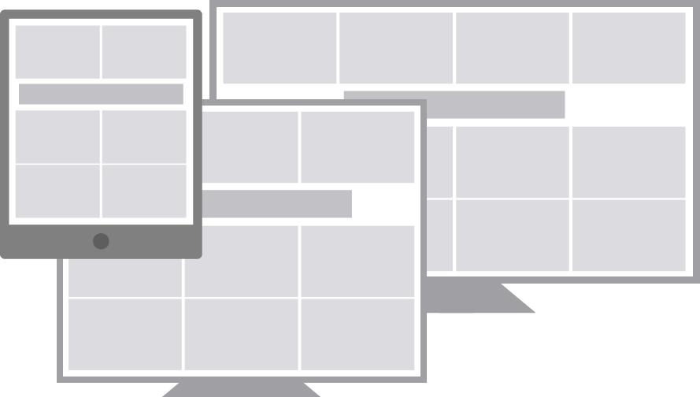

*Note this article was originally published on [Lullabot.com](https://www.lullabot.com/articles/importing-css-breakpoints-into-javascript).*

There are a lot of challenges within responsive web design, and one that that has constantly been a pain is triggering JavaScript based on the current CSS media query breakpoint. The problem is that the breakpoints are in CSS, which JavaScript has no native way to access. Many solutions (including [window.matchMedia()](https://developer.mozilla.org/en-US/docs/Web/API/Window/matchMedia), and [Enquire.js](http://wicky.nillia.ms/enquire.js/)) involve declaring your breakpoints in both CSS and JS, or require IE10+. The problem with these solutions is that when you change a breakpoint value, you have to change it twice. However, it doesn't need to be like this.

## A Simpler Solution

A quick and easy solution to this problem is to have your JS import the breakpoints directly from the CSS values in the DOM. This solution brings the current breakpoint variable into your JS in a way that's

* Simple & Lightweight
* [DRY](http://en.wikipedia.org/wiki/Don%27t_repeat_yourself)
* Compatible with all browsers that support media queries (IE9+)

To see where we're going with this, check out this [fully functioning codepen](http://codepen.io/mherchel/pen/gbygBd). Now, let's get started!

## Declare your breakpoints

For simplicity, this code is straight CSS and can easily be abstracted to Sass or Less.

```css
/**
 * These values will not show up in content, but can be 
 * queried by JavaScript to know which breakpoint is active.
 * Add or remove as many breakpoints as you like.
 */
body:before {
  content: "smartphone";
  display: none; /* Prevent from displaying. */
}
@media (min-width: 700px) {
  body:before {
    content: "tablet";
  }
}
@media (min-width: 1100px) {
  body:before {
    content: "desktop";
  }
}
```

Note that I have to hide the `::before` pseudo-element so it doesn't show to the user.

## Importing the Breakpoints into JavaScript

This is the magic that queries the property for the current breakpoint. In this combination of jQuery and javascript, I'm using an object to store the value.

```js
var breakpoint = {};
breakpoint.refreshValue = function () {
  this.value = window.getComputedStyle(document.querySelector('body'), ':before').getPropertyValue('content').replace(/\"/g, '');
};
```

There's a couple things going on here. I'm querying the content property on the `::before` pseudo element using this [method popularized by David Walsh](http://davidwalsh.name/pseudo-element). I can't attach the content property directly to the body tag, because Internet Explorer 9 will return a value of "normal" when querying. IE10 and IE11 work fine. Ugh!

Firefox and IE return the value with double quotes, while other browsers do not. To get consistent values I'm using replace() with regex to strip those out.

## Trigger on resize and page load

Breakpoints change based on your browser's viewport width, so I need to update the value when the browser is resized. I also trigger a resize event on the initial page load to get the first value.

```js
$(window).resize(function () {
  breakpoint.refreshValue();
}).resize();
```

## In use

This is a simple if-else statement that queries the current breakpoint, and runs code based on the result.

```js
if (breakpoint.value == 'tablet') {
  console.log('Tablet breakpoint');
}
else {
  console.log('Some other breakpoint');
}
```

## Sample Use Case

While redeveloping the website for [Syfy.com](http://www.syfy.com/), I had an interesting problem where I needed to inject a 728x90 leaderboard advertisement within the second row of tiles. The difficult part of this is that the number of tiles per row changes depending on the current breakpoint.



Below is a simplified example of how I handled this.

### 1. Get the current breakpoint

```js
/**
 * Global: Get current CSS breakpoint
 */
 
var breakpoint = {};
breakpoint.refreshValue = function () {
  this.value = window.getComputedStyle(document.querySelector('body'), ':before').getPropertyValue('content').replace(/\"/g, '');
};
```

### 2. Function to pass the number of columns to leaderboardMoveHelper()

```js
/**
 * Pass the number of columns to leaderboardMoveHelper() to do all the work
 */
var leaderboardMove = function() {
  if (breakpoint.value == 'tablet_narrow') {
    leaderboardMoveHelper(2);
  }
  if ((breakpoint.value == 'tablet_wide') || (breakpoint.value == 'normal')) {
    leaderboardMoveHelper(3);
  }
  if (breakpoint.value == 'wide') {
    leaderboardMoveHelper(4);
  }
}
```

### 3. Helper function to move the leaderboard to the appropriate location within the DOM

```js
/**
 * Move the leaderboard to the second row
 */
var leaderboardMoveHelper = function(columns) {
  var $tileView       = $('.tile-container', context),
      $leaderboard    = $('.ad-leaderboard.processed', $tileView),
  // Move the leaderboard
  $('.tile:nth-child(' + (columns+1) + ')', $tileView).after($leaderboard);
  // Indicate it's moved
  $leaderboard.addClass('js-leaderboard-processed');
  $tileView.addClass('js-leaderboard-processed');
};
```

### 4. Run the JS on browser resize and page load

```js
/**
* Execute
*/
$(window).resize(function () {
  breakpoint.refreshValue();
  leaderboardMove();
}).resize();
```

## Conclusion

This is a simplification of a very useful technique. The same logic can also be used to pass breakpoint states of elements by modifying pseudo-elements of any element within the DOM. For example, if you have an element that has a CSS change between multiple breakpoints, you can pass and query the pseudo-element, or can even query for the changing CSS property itself. Feel free to [hack around and fork this over at Codepen](http://codepen.io/mherchel/pen/gbygBd).